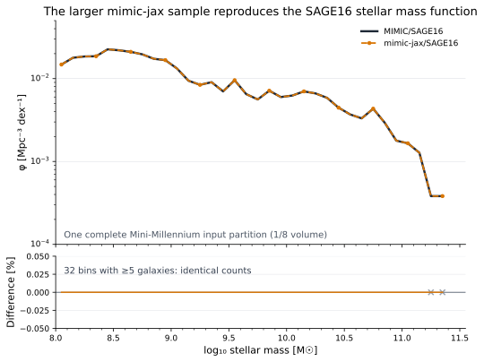
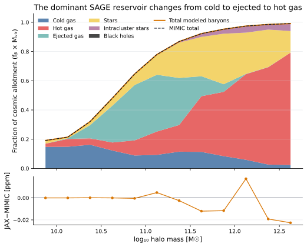
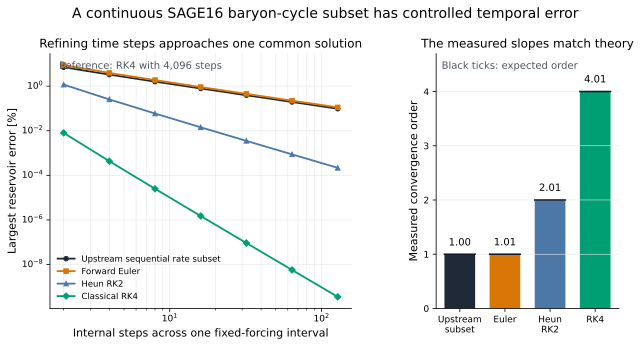
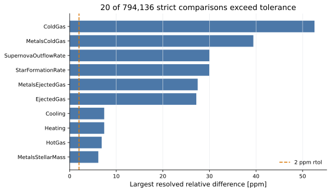

# SAGE16 Mini-Millennium: from equivalence to baryon-cycle insight

A complete Mini-Millennium input partition now connects a familiar SAGE16 stellar mass function to an explicit baryon inventory. MIMIC and mimic-jax are scientifically indistinguishable for the observables shown; strict numerical residuals, controlled derivative checks, and unavailable population responses remain visible so the science story never outruns the evidence.

[Machine-readable manifest](report.json)

## Run overview

| Item | Value |
| --- | --- |
| Model | fiducial SAGE16 |
| Dataset / trees | Mini-Millennium partition 1, all 2,864 trees; 1/8 simulation volume |
| Parameter set | sage16_mini-millennium fiducial |
| Integration method | upstream_sequential, 10 configured substeps |
| Trees in science sample | 2864 |
| Input halos | 151216 |
| Matched z=0 galaxies | 3595 |
| Complete-partition evolution | 147.039 s |
| 1,000-tree first benchmark call | 93.7625 s |
| 1,000-tree best warm call | 4.77476 s |
| Complete-partition peak memory | 7.54306 GiB |
| JAX backend | cpu |

Related: [Report architecture](../../docs/reporting.md) · [Scientific application program](../../docs/mimic_jax_scientific_program.md)

## Run health

| Check | Status | Evidence |
| --- | --- | --- |
| Science-level upstream equivalence | ✅ Passed | MIMIC and mimic-jax are scientifically indistinguishable for the population observables shown. The 1,000-tree control passes 74,172 field comparisons with zero failures, and all resolved stellar-mass-function bins agree exactly in the complete 2,864-tree partition. |
| Stellar mass function | ✅ Passed | All 32 bins containing at least five MIMIC galaxies have identical mimic-jax counts in the complete-partition z=0 sample. |
| Controlled baryon conservation | ✅ Passed | The explicit controlled source/sink ledger closes within tolerance; a full Mini-Millennium history ledger was not evaluated. |
| Metal conservation | ⬚ Not evaluated | A report-level Mini-Millennium metal ledger was not evaluated for this run. |
| Controlled gradient validation | ✅ Passed | A controlled quiescent SAGE16 step has a logarithmic parameter response that agrees with symmetric finite differences; this is not yet an SMF response. |
| Does the continuous SAGE16 subset converge in time? | ✅ Passed | The isolated rates match their upstream SAGE16 budgets, the reservoir ledger closes, and every tested method reaches its expected temporal order. |
| Stellar-mass-function parameter response | ⬚ Not evaluated | A validated differentiable estimator for hard stellar-mass-function bin membership has not yet been run on this partition. No raw or zero-almost-everywhere histogram gradient is shown. |
| Population timestep convergence | ⬚ Not evaluated | The stellar mass function has not yet been recomputed at refined Mini-Millennium substeps. The controlled central refinement remains technical API evidence only. |

## At a glance



*The top panel is the familiar z=0 SAGE16 stellar mass function for one complete Mini-Millennium input partition. The lower panel is the percentage bin-by-bin difference; all 32 bins containing at least five reference galaxies have identical counts.*

## What did this larger run teach us?

These statements are generated from the committed JSON/NPZ products rather than being hand-maintained narrative claims.

- The complete partition contains 2,864 trees, 151,216 input halos, and 3,595 matched z=0 galaxies; its evolution with the persistent compilation cache enabled completed in 147.0 s.
- All 32 stellar-mass bins with at least five reference galaxies have identical MIMIC and mimic-jax counts.
- Cold gas is the largest modeled share of the universal baryon allotment over 9.75 ≤ log10(Mvir/Msun) < 10.50 in bins containing at least ten FoF groups.
- Ejected gas is the largest modeled share of the universal baryon allotment over 10.50 ≤ log10(Mvir/Msun) < 11.50 in bins containing at least ten FoF groups.
- Hot gas is the largest modeled share of the universal baryon allotment over 11.50 ≤ log10(Mvir/Msun) < 12.75 in bins containing at least ten FoF groups.
- The complete all-snapshot field gate retains 20 residuals among 794,136 comparisons (0.002518%, maximum relative difference 5.26e-05). These are negligible for the science observables shown, while remaining visible in technical validation.
- For the fixed-halo, smooth quiescent reservoir subset, the repeated upstream-order update and forward Euler converge at first order, Heun at second order, and RK4 at fourth order; this is a controlled time-integration result, not yet a population-level Mini-Millennium convergence claim.

## Does mimic-jax reproduce familiar SAGE16?

The opening comparison uses a complete Mini-Millennium input partition with the same volume normalization and 0.1-dex bins as the familiar MIMIC plot. The full-volume upstream figure below retains the observational context used by SAGE practitioners.

Related: [SAGE16 plotting manual](../../plot/mimic-plot/README.md) · [Mini-Millennium equivalence evidence](../../docs/mini_millennium_equivalence.md)


*The familiar SAGE diagnostic is sourced from the upstream MIMIC catalogue. It is context, not a claim of full mimic-jax population equivalence.*

### Stellar mass function

**Status:** ✅ Passed

All 32 bins containing at least five MIMIC galaxies have identical mimic-jax counts in the complete-partition z=0 sample.

**Method:** matched z=0 catalogue, 0.1-dex bins, one complete input partition

**Acceptance criterion:** exact bin counts where the MIMIC bin contains at least five galaxies

| Quantity | Value | Interpretation |
| --- | ---: | --- |
| Resolved SMF bins | 32 | at least five MIMIC galaxies per 0.1-dex bin |
| Resolved bins with different counts | 0 | zero is required by this population-level gate |
| Maximum resolved fractional abundance difference | 0 | fractional, not percent |
| Individual stellar masses that are not bit-identical | 175 | out of 3,595 matched z=0 galaxies |
| Largest resolved stellar-mass relative difference | 3.30747e-06 | the small object-level residuals do not cross an SMF bin edge |

- This is a population-level agreement test, weaker than the per-object field gate; both are reported.
- 175 individual stellar masses are not bit-identical, so identical histogram counts are not presented as exact per-galaxy equivalence.

[Complete-partition science summary JSON](assets/partition-science.json) — Machine-readable scope, metrics, runtime, and evidence-backed findings.

[Complete-partition science arrays](assets/mini-millennium-partition-1-science.npz) — Matched SMF, group baryon inventory, quenched-fraction, cooling, and heating summaries.

## Where are the baryons?

The explicit SAGE reservoirs can be read as a physical inventory. Each stack is the total reservoir mass of a FoF group divided by its universal baryon allotment, making reionization/ejection suppression and the hot-halo transition visible before the small catalogue-equivalence residual is shown.

Related: [Reservoir and transfer model](../../docs/reservoirs_and_transfers.md) · [Conservation contract](../../docs/conservation.md)



*Reservoir masses are summed over each FoF group and normalized by its universal baryon allotment. The residual panel compares the same inventory between mimic-jax and MIMIC; it is a catalogue-equivalence residual, not a time-integrated conservation residual.*

- Cold gas is the largest modeled share of the universal baryon allotment over 9.75 ≤ log10(Mvir/Msun) < 10.50 in bins containing at least ten FoF groups.
- Ejected gas is the largest modeled share of the universal baryon allotment over 10.50 ≤ log10(Mvir/Msun) < 11.50 in bins containing at least ten FoF groups.
- Hot gas is the largest modeled share of the universal baryon allotment over 11.50 ≤ log10(Mvir/Msun) < 12.75 in bins containing at least ten FoF groups.

## What controls the stellar mass function?

The public-facing quantity will be percentage abundance change per 1% parameter change. Hard catalogue bins are discrete, so mimic-jax will not substitute the pathwise derivative of fixed bin assignments for a population response.

Related: [Fractional-response API](../../docs/sensitivity.md)

### Stellar-mass-function parameter response

**Status:** ⬚ Not evaluated

A validated differentiable estimator for hard stellar-mass-function bin membership has not yet been run on this partition. No raw or zero-almost-everywhere histogram gradient is shown.

**Method:** not evaluated

- The next science milestone remains E_i(M*) = d ln phi / d ln theta with symmetric finite-difference validation.

## Where does AGN regulation take over from cooling?

The familiar black-hole–bulge relation establishes the relevant SAGE population, but the causal cooling-versus-AGN response map is deliberately withheld until epoch-binned process perturbations are validated.

Related: [Radio-mode heating prescription](../../docs/radio_mode_heating.md)


*An existing model-local SAGE16 plot generated without report-specific logic.*

### Cooling and AGN historical response

**Status:** ⬚ Not evaluated

Epoch-binned cooling and AGN perturbations were not evaluated for this catalogue, so the report does not infer causal regulation from instantaneous output correlations.

## How accurately are these histories being integrated?

The exact upstream-sequential path remains the SAGE16 reference. Separately, a fixed-halo continuous reservoir experiment now demonstrates genuine convergence in time: upstream-order splitting and Euler are first order, Heun is second order, and RK4 is fourth order. The wider hybrid formulation treats prepared infall as external forcing, makes AGN memory Markovian with stored `Rheat`, represents stripping as a group flow, and retains projections and mergers as events. Population-level convergence must still be tested through familiar observables and is not inferred from this controlled experiment.

Related: [Numerical integration contract](../../docs/numerical_integration.md) · [Complete SAGE16 hybrid classification](../../docs/sage16_hybrid_system.md)

### Does the continuous SAGE16 subset converge in time?

**Status:** ✅ Passed

The isolated rates match their upstream SAGE16 budgets, the reservoir ledger closes, and every tested method reaches its expected temporal order.

**Method:** fixed-forcing upstream split, Euler, Heun RK2, and RK4

**Acceptance criterion:** rate relative difference <= 2e-14; baryon residual <= 2e-12; observed orders within 0.15

| Quantity | Value | Interpretation |
| --- | ---: | --- |
| Largest isolated rate mismatch | 1.32386e-16 | continuous rate versus the matching upstream finite budget divided by dt |
| Largest integrated baryon residual | 7.10543e-15 1e10 Msun/h | across the float64 continuous integrators and refinement levels |
| Largest upstream-split storage residual | 8.52346e-06 1e10 Msun/h | includes SAGE16 float32 reservoir writes at every sequential step |
| upstream_rate_subset observed order | 1.00364 | median of the final two maximum-error ratios |
| upstream_rate_subset finest maximum relative error | 0.000972632 | at 128 steps |
| forward_euler observed order | 1.00613 | median of the final two maximum-error ratios |
| forward_euler finest maximum relative error | 0.00111903 | at 128 steps |
| heun_rk2 observed order | 2.00933 | median of the final two maximum-error ratios |
| heun_rk2 finest maximum relative error | 2.16775e-06 | at 128 steps |
| rk4 observed order | 4.00992 | median of the final two maximum-error ratios |
| rk4 finest maximum relative error | 3.54542e-12 | at 128 steps |

- The independent reference is `rk4` with 4,096 fixed steps.
- Halo forcing interpolation: `piecewise_constant`.
- `upstream_rate_subset` approaches order 1.004; the expected order is 1.
- `forward_euler` approaches order 1.006; the expected order is 1.
- `heun_rk2` approaches order 2.009; the expected order is 2.
- `rk4` approaches order 4.010; the expected order is 4.



*The left panel measures the largest relative error among four baryon and four metal reservoirs against an independent fine RK4 reference. The right panel shows that the upstream split and Euler are first order, Heun is second order, and RK4 is fourth order for this smooth fixed-forcing interval.*

[Continuous-subset convergence arrays](assets/ode_time_convergence.npz) — Methods, step sizes, eight reservoir histories, independent-reference errors, measured orders, and method metadata.

### Population timestep convergence

**Status:** ⬚ Not evaluated

The stellar mass function has not yet been recomputed at refined Mini-Millennium substeps. The controlled central refinement remains technical API evidence only.

### Timestep refinement

**Status:** ⬚ Not evaluated

Timestep refinement was evaluated, but no acceptance threshold was supplied.

**Method:** upstream_sequential

| Quantity | Value | Interpretation |
| --- | ---: | --- |
| Maximum coarsest-to-finest relative difference | 0.322599 | reported only for observables with nonzero finest values |
| Maximum coarsest-to-finest absolute difference | 0.630753 | in the underlying observable units |

- The finest requested run is a provisional reference, not an exact solution.
- Halo forcing interpolation: `piecewise_constant`.

[Controlled timestep-refinement arrays](assets/controlled_timestep_refinement.npz) — Substeps, observables, provisional errors, and empirical orders.

## Can a scientifically larger sample run interactively?

The 1,000-tree benchmark is ten times the original report sample and separates first-process and warmed calls. The complete-partition science product records its own runtime and peak memory; neither number is compared unfairly with upstream compilation excluded on only one side.

Related: [Current performance evidence](../../docs/performance.md)

### Performance

**Status:** ⚠️ Warning

Warmed execution is much faster than the first call, but the cold catalogue path is currently much slower than upstream MIMIC; no JAX speedup is claimed.

**Method:** wall-clock benchmark

| Quantity | Value | Interpretation |
| --- | ---: | --- |
| First evolution time | 93.7625 s | includes cold compilation and execution in this benchmark process |
| Best warm evolution time | 4.77476 s | best repeat after the first invocation |
| Trees | 1000 |  |
| Input halos | 24885 |  |

- Compilation cost and warmed execution are reported separately.

[Selected-tree benchmark JSON](assets/benchmark.json) — Cold/warm timing, backend, device, memory, shapes, and catalogue digest.

## Why should we trust these results?

The science panels above are supported by stronger per-object comparisons and controlled invariant/derivative tests. The strict field residuals are retained to distinguish scientific identity from bitwise equality.

Related: [Mini-Millennium equivalence evidence](../../docs/mini_millennium_equivalence.md) · [Conservation contract](../../docs/conservation.md) · [Fractional-response API](../../docs/sensitivity.md)

### Upstream equivalence

**Status:** ✅ Passed

All requested comparisons passed for Mini-Millennium trees 1500–2499.

**Method:** field-by-field catalogue comparison

**Acceptance criterion:** float32/Cooling/Heating rtol=atol=2e-6; other float64 rtol=atol=2e-12; integers exact

| Quantity | Value | Interpretation |
| --- | ---: | --- |
| Field comparisons | 74172 | Mini-Millennium trees 1500–2499 |
| Comparisons outside tolerance | 0 | zero is required for a passing equivalence check |

[Zero-failure 1,000-tree equivalence JSON](assets/equivalence.json) — Exact evaluated scope, comparison count, tolerances, and residual summary.

### Complete-partition field comparison

**Status:** ⚠️ Warning

20 of 794,136 strict field comparisons exceed the stated mixed-precision tolerance. The residuals remain open; agreement of a population statistic does not erase them.

**Method:** field-by-field matching by UniqueGalaxyID over all configured snapshots

**Acceptance criterion:** float32/Cooling/Heating rtol=atol=2e-6; other float64 rtol=atol=2e-12; integers exact

| Quantity | Value | Interpretation |
| --- | ---: | --- |
| Trees | 2864 | every tree in input partition 1 |
| Catalogue records | 18908 | all configured output snapshots |
| Field comparisons | 794136 |  |
| Comparisons outside tolerance | 20 |  |

[Complete-partition equivalence JSON](assets/partition-equivalence.json) — All-snapshot field comparison for every tree in Mini-Millennium input partition 1.



*The strict field gate remains visible: 20 comparisons exceed the stated mixed-precision tolerance even though the resolved stellar-mass-function bins agree.*

### Baryon conservation

**Status:** ✅ Passed

Baryon mass conservation satisfies the stated ledger tolerance.

**Method:** controlled central source/sink ledger over 1, 2, 4, and 8 substeps

**Acceptance criterion:** maximum absolute residual <= 3e-06 1e10 Msun/h

| Quantity | Value | Interpretation |
| --- | ---: | --- |
| Maximum absolute residual | 2.43727e-06 1e10 Msun/h | ledger delta minus explicit sources plus sinks |

### Metal conservation

**Status:** ⬚ Not evaluated

A report-level Mini-Millennium metal ledger was not evaluated for this run.

### Fractional parameter responses

**Status:** ✅ Passed

At least one tested symmetric finite-difference step agrees with automatic differentiation within the stated tolerance.

**Method:** jax.jacrev

**Acceptance criterion:** best tested maximum absolute error <= 2e-05

| Quantity | Value | Interpretation |
| --- | ---: | --- |
| Valid response entries | 4 | out of 4 observable-parameter entries |
| Largest absolute fractional response | 0.0888728 | largest magnitude in the response matrix |
| Best finite-difference maximum absolute error | 1.74834e-06 | symmetric multiplicative step 0.01 |
| Worst finite-difference maximum absolute error | 4.63153e-05 | largest error across all tested perturbation sizes |

- A 1% increase in `SfrEfficiency` decreases `final_cold_gas` by approximately 0.0889%.
- A 1% increase in `FeedbackReheatingEpsilon` decreases `final_cold_gas` by approximately 0.0747%.
- A 1% increase in `SfrEfficiency` increases `final_stellar_mass` by approximately 0.0612%.
- A 1% increase in `FeedbackReheatingEpsilon` does not change `final_stellar_mass` by approximately 0%.

[Controlled fractional parameter response arrays](assets/controlled_parameter_response.npz) — Values, validity mask, normalization, names, units, and derivative method.

## Parameters

| Parameter | Value | Units | Description |
| --- | ---: | --- | --- |
| `GlobalBaryonFraction` | 0.17 | dimensionless | Universal baryon fraction available to haloes. |
| `SfrEfficiency` | 0.05 | dimensionless | Quiescent star-formation efficiency per disk dynamical time. |
| `StarFormingDiskFactor` | 3 | dimensionless | Disk-radius multiple used by the star-formation threshold. |
| `FeedbackReheatingEpsilon` | 3 | dimensionless | SN reheating mass loading from cold to hot gas. |
| `FeedbackEjectionEfficiency` | 0.3 | dimensionless | SN energy efficiency for ejecting gas from the halo. |
| `ReIncorporationFactor` | 0.15 | dimensionless | Return rate of ejected gas to the hot halo. |
| `AGNrecipe` | 2 | dimensionless | Radio-mode black-hole accretion prescription selector. |
| `RadioModeEfficiency` | 0.08 | dimensionless | Efficiency with which radio-mode accretion heats halo gas. |
| `BlackHoleGrowthRate` | 0.015 | dimensionless | Cold-gas accretion efficiency in quasar-mode events. |
| `QuasarModeEfficiency` | 0.005 | dimensionless | Efficiency of quasar-mode gas ejection. |
| `RecycleFraction` | 0.43 | dimensionless | Fraction of newly formed stellar mass returned immediately to gas. |
| `Yield` | 0.025 | dimensionless | New metal mass produced per unit newly formed stellar mass. |
| `FracZleaveDisk` | 0 | dimensionless | Fraction of new metals deposited directly into hot gas. |
| `ThresholdMajorMerger` | 0.3 | dimensionless | Baryonic mass-ratio threshold for a major merger. |
| `ThresholdSatDisruption` | 1 | dimensionless | Halo-to-baryon threshold for satellite disruption. |

## Provenance and reproducibility

| Item | Value |
| --- | --- |
| Generated | 2026-08-18T12:43:45Z |
| Git commit | `a6f5bf42c25e37633ac920e8793d5bf160921846` (dirty working tree) |
| Git branch | main |

### Rerun command

```shell
mimic_venv/bin/python examples/build_mini_millennium_report.py --equivalence-json archive/mini-millennium-equivalence-1000.json --partition-equivalence-json archive/mini-millennium-equivalence-partition-1.json --benchmark-json archive/mini-millennium-benchmark-1000.json --science-json archive/mini-millennium-partition-1-science.json --science-arrays archive/mini-millennium-partition-1-science.npz
```

### Configurations and inputs

| Role | Path | SHA-256 | Bytes |
| --- | --- | --- | ---: |
| configuration | `models/sage16/input/sage16_mini-millennium.yaml` | `9e1e5212817ee324a9c13e3b1faa86aec1b2979571c0655f070cd6c234e39cf1` | 3747 |
| configuration | `simulations/mini-millennium/mini-millennium.a_list` | `2866412ae276939c625afef8a92a1da442fcc4bd8490dda191f38a0f5028164f` | 577 |
| input | `output/sage16-mini-millennium/model.hdf5` | `13611c1bb0081abc543746599793255fd0bd6adde35a56a6672384b6d78de3b9` | 177932 |
| input | `output/sage16-mini-millennium/metadata/version_info.json` | `62b52f374e61ab4ee9289ecfaf818b538ca7e0c30acee45f11b793263ac73237` | 392 |
| input | `output/sage16-mini-millennium/model_000.hdf5` | `5a379968075170672ba7a45b191f4527cde70a3ef4a5dac98e3bf3a4e8821e95` | 7176983 |
| input | `output/sage16-mini-millennium/model_001.hdf5` | `059d2243b37409da2e2399cd700b43509a98ba5efa3932e2d3972c839c17eda7` | 6366807 |
| input | `output/sage16-mini-millennium/model_002.hdf5` | `08c22c6ce8014da859fd3d8cee78a9337a942681b541da565893dae5c9b18060` | 9322359 |
| input | `output/sage16-mini-millennium/model_003.hdf5` | `2e1731d6a175cb8efbffdb01031a4fe2d733addccfccc6e1e83e194c414f72f7` | 11976855 |
| input | `output/sage16-mini-millennium/model_004.hdf5` | `cbd810a2b926fc89a0d9cf32a7a72a2bb9842cd9ded98810b8f08e65972fbb67` | 6651415 |
| input | `output/sage16-mini-millennium/model_005.hdf5` | `d2c1fbaee8e6d381ef5b0527ba34dd9ba4cc54e24548bb2fa806dea826ae84c9` | 7189815 |
| input | `output/sage16-mini-millennium/model_006.hdf5` | `5d1cc3180a87c1ad445bf28a16732dcd7002a2642f1175b64c09e411a9677041` | 5846967 |
| input | `output/sage16-mini-millennium/model_007.hdf5` | `18e810dc839da64e84bbb2439b22255f64819ba472f7af315d93b00c8a8443f7` | 5856791 |
| input | `archive/mini-millennium-equivalence-1000.json` | `1cad2f26b97e9fe07b87bbafa92a8dc89f035eb66264009de60d5562a3cc4c3d` | 1106 |
| input | `archive/mini-millennium-equivalence-partition-1.json` | `0cf9f1230a5d36c141266fb68b9124ce648f1bd5df0cb0c2a845ec592d4e59e8` | 1105 |
| input | `archive/mini-millennium-benchmark-1000.json` | `24f07615a8d6819e942cc05f9d2b6922d0a441046ead7471ce61a9cff55eee92` | 1590 |
| input | `archive/mini-millennium-partition-1-science.json` | `137c8b29aa42ac4d7cee031fae3a6b75d490eedf743c48748ea67ea79dd202c4` | 2658 |
| input | `archive/mini-millennium-partition-1-science.npz` | `3d81a5dfd5c79c61725484076319098f5f3a6d8a23eb4dd95ce0921e47f49f5c` | 14410 |

### Software

| Name | Value |
| --- | --- |
| PyYAML | 6.0.3 |
| h5py | 3.14.0 |
| jax | 0.4.30 |
| jaxlib | 0.4.30 |
| matplotlib | 3.9.4 |
| numpy | 2.0.2 |
| python | 3.9.6 |

### Hardware and backend

| Name | Value |
| --- | --- |
| jax_backend | cpu |
| jax_devices | ['TFRT_CPU_0'] |
| machine | arm64 |
| processor | arm |
| release | 25.6.0 |
| system | Darwin |

### Upstream MIMIC run record

```json
{
  "build_date": "Aug 18 2026",
  "compiler": "gcc 4.2.1",
  "git_branch": "main",
  "git_commit": "0e8af407f1ee8fde83ea23103abba4e131072232",
  "parameters": {
    "file_path": "models/sage16/input/sage16_mini-millennium.yaml",
    "parameter_md5_checksum": "3687eee7e3c9012562d0b57eefe98110"
  },
  "run_date": "2026-08-18T07:37:12Z",
  "system": "macOS 26.6.1 arm64",
  "user": "tabel"
}
```
