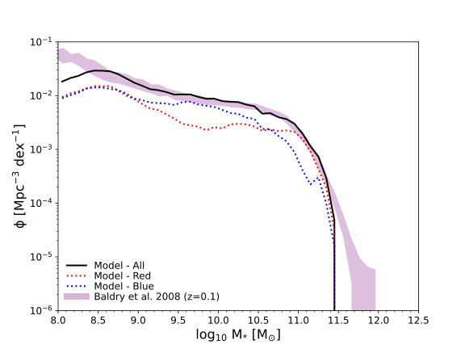
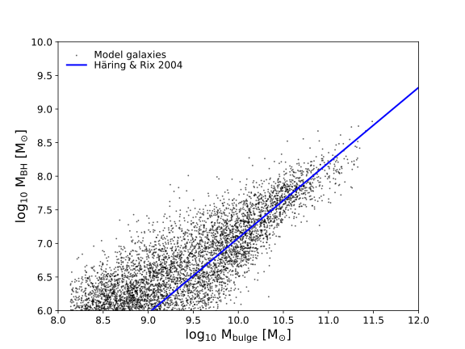

# SAGE16 Mini-Millennium: initial mimic-jax run report

This report combines familiar upstream MIMIC figures with the current selected-tree mimic-jax equivalence gate and controlled conservation, timestep, gradient, and performance diagnostics. It deliberately does not claim full-population equivalence.

[Machine-readable manifest](report.json)

## Run overview

| Item | Value |
| --- | --- |
| Model | fiducial SAGE16 |
| Dataset / trees | Mini-Millennium, selected trees 1500–1599 |
| Parameter set | sage16_mini-millennium fiducial |
| Integration method | upstream_sequential, 10 configured substeps |
| Trees in selected gate | 100 |
| Input halos | 2932 |
| Catalogue records compared | 224 |
| First evolution call | 46.4612 s |
| Best warm evolution call | 1.01602 s |
| JAX backend | cpu |

Related: [Report architecture](../../docs/reporting.md) · [Scientific application program](../../docs/mimic_jax_scientific_program.md)

## Run health

| Check | Status | Evidence |
| --- | --- | --- |
| Upstream equivalence | ⚠️ Warning | The selected 100-tree control passes, but full-population equivalence is not yet established and the separate complex tree-0 gate retains one known mismatch. |
| Baryon conservation | ✅ Passed | Baryon mass conservation satisfies the stated ledger tolerance. |
| Metal conservation | ⬚ Not evaluated | A report-level Mini-Millennium metal ledger was not evaluated for this run. |
| Fractional parameter responses | ✅ Passed | At least one tested symmetric finite-difference step agrees with automatic differentiation within the stated tolerance. |
| Timestep refinement | ⬚ Not evaluated | Timestep refinement was evaluated, but no acceptance threshold was supplied. |

## At a glance



*The familiar SAGE diagnostic is sourced from the upstream MIMIC catalogue. It is context, not a claim of full mimic-jax population equivalence.*

## Familiar SAGE science

These figures come directly from the existing SAGE16 plot registry and the upstream MIMIC catalogue. They establish the practitioner-facing context before new diagnostics are introduced.

Related: [SAGE16 plotting manual](../../plot/mimic-plot/README.md)


*The familiar SAGE diagnostic is sourced from the upstream MIMIC catalogue. It is context, not a claim of full mimic-jax population equivalence.*



*An existing model-local SAGE16 plot generated without report-specific logic.*

## What has been matched upstream?

The evaluated sample compares catalogue fields by `UniqueGalaxyID` over every configured output snapshot. Its scope is stated explicitly.

Related: [Mini-Millennium equivalence evidence](../../docs/mini_millennium_equivalence.md)

### Upstream equivalence

**Status:** ✅ Passed

All requested comparisons passed for Mini-Millennium trees 1500–1599.

**Method:** field-by-field catalogue comparison

**Acceptance criterion:** float32/Cooling/Heating rtol=atol=2e-6; other float64 rtol=atol=2e-12; integers exact

| Quantity | Value | Interpretation |
| --- | ---: | --- |
| Field comparisons | 9408 | Mini-Millennium trees 1500–1599 |
| Comparisons outside tolerance | 0 | zero is required for a passing equivalence check |

[Selected-tree equivalence JSON](assets/equivalence.json) — Exact evaluated scope, comparison count, tolerances, and residual summary.

## Conservation

Executable ledgers make closed transfers and explicit sources or sinks visible. This first report includes a controlled baryon check only.

Related: [Conservation contract](../../docs/conservation.md)

### Baryon conservation

**Status:** ✅ Passed

Baryon mass conservation satisfies the stated ledger tolerance.

**Method:** controlled central source/sink ledger over 1, 2, 4, and 8 substeps

**Acceptance criterion:** maximum absolute residual <= 3e-06 1e10 Msun/h

| Quantity | Value | Interpretation |
| --- | ---: | --- |
| Maximum absolute residual | 2.43727e-06 1e10 Msun/h | ledger delta minus explicit sources plus sinks |

### Metal conservation

**Status:** ⬚ Not evaluated

A report-level Mini-Millennium metal ledger was not evaluated for this run.

## Numerical integration

The faithful upstream-sequential method is refined on a controlled fixed-forcing central. This is API evidence, not Mini-Millennium convergence.

Related: [Numerical integration contract](../../docs/numerical_integration.md)

### Timestep refinement

**Status:** ⬚ Not evaluated

Timestep refinement was evaluated, but no acceptance threshold was supplied.

**Method:** upstream_sequential

| Quantity | Value | Interpretation |
| --- | ---: | --- |
| Maximum coarsest-to-finest relative difference | 0.322599 | reported only for observables with nonzero finest values |
| Maximum coarsest-to-finest absolute difference | 0.630753 | in the underlying observable units |

- The finest requested run is a provisional reference, not an exact solution.
- Halo forcing interpolation: `piecewise_constant`.

[Controlled timestep-refinement arrays](assets/controlled_timestep_refinement.npz) — Substeps, observables, provisional errors, and empirical orders.

## How does familiar SAGE physics change the result?

The first validated derivative is shown as a fractional response: percentage change in the observable per 1% parameter change. The example is a controlled quiescent disk step, not a population response.

Related: [Fractional-response API](../../docs/sensitivity.md)

### Fractional parameter responses

**Status:** ✅ Passed

At least one tested symmetric finite-difference step agrees with automatic differentiation within the stated tolerance.

**Method:** jax.jacrev

**Acceptance criterion:** best tested maximum absolute error <= 2e-05

| Quantity | Value | Interpretation |
| --- | ---: | --- |
| Valid response entries | 4 | out of 4 observable-parameter entries |
| Largest absolute fractional response | 0.0888728 | largest magnitude in the response matrix |
| Best finite-difference maximum absolute error | 1.74834e-06 | symmetric multiplicative step 0.01 |
| Worst finite-difference maximum absolute error | 4.63153e-05 | largest error across all tested perturbation sizes |

- A 1% increase in `SfrEfficiency` decreases `final_cold_gas` by approximately 0.0889%.
- A 1% increase in `FeedbackReheatingEpsilon` decreases `final_cold_gas` by approximately 0.0747%.
- A 1% increase in `SfrEfficiency` increases `final_stellar_mass` by approximately 0.0612%.
- A 1% increase in `FeedbackReheatingEpsilon` does not change `final_stellar_mass` by approximately 0%.

[Controlled fractional parameter response arrays](assets/controlled_parameter_response.npz) — Values, validity mask, normalization, names, units, and derivative method.

## Performance

Compilation, first execution, warmed execution, host work, catalogue conversion, and memory are kept distinct.

Related: [Current performance evidence](../../docs/performance.md)

### Performance

**Status:** ⚠️ Warning

Warmed execution is much faster than the first call, but the cold catalogue path is currently much slower than upstream MIMIC; no JAX speedup is claimed.

**Method:** wall-clock benchmark

| Quantity | Value | Interpretation |
| --- | ---: | --- |
| First evolution time | 46.4612 s | includes cold compilation and execution in this benchmark process |
| Best warm evolution time | 1.01602 s | best repeat after the first invocation |
| Trees | 100 |  |
| Input halos | 2932 |  |

- Compilation cost and warmed execution are reported separately.

[Selected-tree benchmark JSON](assets/benchmark.json) — Cold/warm timing, backend, device, memory, shapes, and catalogue digest.

## Parameters

| Parameter | Value | Units | Description |
| --- | ---: | --- | --- |
| `GlobalBaryonFraction` | 0.17 | dimensionless |  |
| `SfrEfficiency` | 0.05 | dimensionless |  |
| `StarFormingDiskFactor` | 3 | dimensionless |  |
| `FeedbackReheatingEpsilon` | 3 | dimensionless |  |
| `FeedbackEjectionEfficiency` | 0.3 | dimensionless |  |
| `ReIncorporationFactor` | 0.15 | dimensionless |  |
| `AGNrecipe` | 2 | dimensionless |  |
| `RadioModeEfficiency` | 0.08 | dimensionless |  |
| `BlackHoleGrowthRate` | 0.015 | dimensionless |  |
| `QuasarModeEfficiency` | 0.005 | dimensionless |  |
| `RecycleFraction` | 0.43 | dimensionless |  |
| `Yield` | 0.025 | dimensionless |  |
| `FracZleaveDisk` | 0 | dimensionless |  |
| `ThresholdMajorMerger` | 0.3 | dimensionless |  |
| `ThresholdSatDisruption` | 1 | dimensionless |  |

## Provenance and reproducibility

| Item | Value |
| --- | --- |
| Generated | 2026-08-18T09:08:43Z |
| Git commit | `56d9da55fa26c1433c74d3ae534eb5a6ccb808fb` (clean working tree) |
| Git branch | main |

### Rerun command

```shell
mimic_venv/bin/python examples/build_mini_millennium_report.py --equivalence-json benchmarks/mini-millennium-equivalence.json --benchmark-json benchmarks/mini-millennium-benchmark.json
```

### Configurations and inputs

| Role | Path | SHA-256 | Bytes |
| --- | --- | --- | ---: |
| configuration | `models/sage16/input/sage16_mini-millennium.yaml` | `9e1e5212817ee324a9c13e3b1faa86aec1b2979571c0655f070cd6c234e39cf1` | 3747 |
| configuration | `simulations/mini-millennium/mini-millennium.a_list` | `2866412ae276939c625afef8a92a1da442fcc4bd8490dda191f38a0f5028164f` | 577 |
| input | `output/sage16-mini-millennium/model.hdf5` | `13611c1bb0081abc543746599793255fd0bd6adde35a56a6672384b6d78de3b9` | 177932 |
| input | `output/sage16-mini-millennium/metadata/version_info.json` | `62b52f374e61ab4ee9289ecfaf818b538ca7e0c30acee45f11b793263ac73237` | 392 |
| input | `output/sage16-mini-millennium/model_000.hdf5` | `5a379968075170672ba7a45b191f4527cde70a3ef4a5dac98e3bf3a4e8821e95` | 7176983 |
| input | `output/sage16-mini-millennium/model_001.hdf5` | `059d2243b37409da2e2399cd700b43509a98ba5efa3932e2d3972c839c17eda7` | 6366807 |
| input | `output/sage16-mini-millennium/model_002.hdf5` | `08c22c6ce8014da859fd3d8cee78a9337a942681b541da565893dae5c9b18060` | 9322359 |
| input | `output/sage16-mini-millennium/model_003.hdf5` | `2e1731d6a175cb8efbffdb01031a4fe2d733addccfccc6e1e83e194c414f72f7` | 11976855 |
| input | `output/sage16-mini-millennium/model_004.hdf5` | `cbd810a2b926fc89a0d9cf32a7a72a2bb9842cd9ded98810b8f08e65972fbb67` | 6651415 |
| input | `output/sage16-mini-millennium/model_005.hdf5` | `d2c1fbaee8e6d381ef5b0527ba34dd9ba4cc54e24548bb2fa806dea826ae84c9` | 7189815 |
| input | `output/sage16-mini-millennium/model_006.hdf5` | `5d1cc3180a87c1ad445bf28a16732dcd7002a2642f1175b64c09e411a9677041` | 5846967 |
| input | `output/sage16-mini-millennium/model_007.hdf5` | `18e810dc839da64e84bbb2439b22255f64819ba472f7af315d93b00c8a8443f7` | 5856791 |

### Software

| Name | Value |
| --- | --- |
| PyYAML | 6.0.3 |
| h5py | 3.14.0 |
| jax | 0.4.30 |
| jaxlib | 0.4.30 |
| matplotlib | 3.9.4 |
| numpy | 2.0.2 |
| python | 3.9.6 |

### Hardware and backend

| Name | Value |
| --- | --- |
| jax_backend | cpu |
| jax_devices | ['TFRT_CPU_0'] |
| machine | arm64 |
| processor | arm |
| release | 25.6.0 |
| system | Darwin |

### Upstream MIMIC run record

```json
{
  "build_date": "Aug 18 2026",
  "compiler": "gcc 4.2.1",
  "git_branch": "main",
  "git_commit": "0e8af407f1ee8fde83ea23103abba4e131072232",
  "parameters": {
    "file_path": "models/sage16/input/sage16_mini-millennium.yaml",
    "parameter_md5_checksum": "3687eee7e3c9012562d0b57eefe98110"
  },
  "run_date": "2026-08-18T07:37:12Z",
  "system": "macOS 26.6.1 arm64",
  "user": "tabel"
}
```
