# What controls galaxies in SAGE16?

A science-first Mini-Millennium experiment: first establish that this is SAGE16, then ask which parameters and baryonic processes shape familiar galaxy predictions, when they matter, and whether the conventional timestep changes the answer.

[Machine-readable manifest](report.json)

## Run overview

| Item | Value |
| --- | --- |
| Model | fiducial SAGE16 |
| Dataset / trees | Mini-Millennium partition 1; 2,864 trees; 1/8 simulation volume |
| Parameter set | sage16_mini-millennium fiducial |
| Integration method | upstream sequential update; 10 substeps (reference mode) |
| Trees | 2864 |
| Input haloes | 151216 |
| Matched z=0 galaxies | 3595 |
| Differentiated parameters | 7 |
| History targets | 51 |
| JAX backend | cpu |
| Complete-partition response runtime | 433.333 s |
| Response peak resident memory | 21.2042 GiB |

Related: [Original validation report](../mini-millennium-sage16-initial/) · [Scientific program](../../docs/mimic_jax_scientific_program.md)

## Run health

| Check | Status | Evidence |
| --- | --- | --- |
| Upstream SAGE16 equivalence | ✅ Passed | All 32 resolved z=0 stellar-mass-function bins are identical and the complete partition field gate passes at its stated mixed-precision tolerances. |
| SMF parameter-response validation | ✅ Passed | Representative automatic fractional responses agree with explicit symmetric parameter reruns to <=0.078 in resolved bins for the tested 1% perturbations. |
| Historical-response validation | ✅ Passed | Cooling and AGN epoch responses converge toward the automatic local response as the symmetric intervention shrinks; the 0.1% test meets the stated tolerance. |
| Adaptive continuous-flow convergence | ✅ Passed | All 27/27 smooth fixed-forcing intervals completed at rtol=1e-7; the maximum reservoir error was 6.00e-07 and the maximum stellar-mass error was 2.54e-09 dex. |
| Population timestep convergence | ⚠️ Warning | At the current 80-substep reference, the default run differs by 4.81% in the median and 57.81% at maximum across resolved SMF bins (8.05–10.55). |
| Full-history metal ledger | ⬚ Not evaluated | The complete Mini-Millennium metal source/sink ledger has not yet been accumulated. |

## At a glance

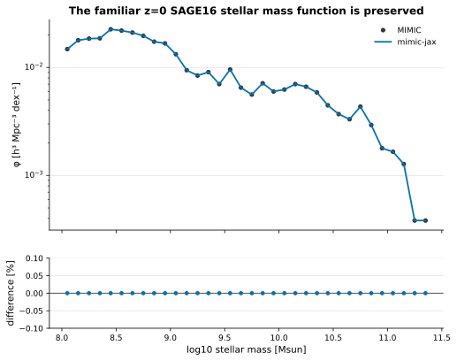

*MIMIC and mimic-jax have identical counts in all 32 resolved hard SMF bins.*

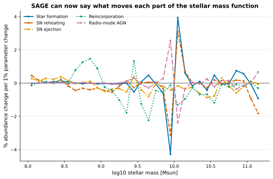

*Fractional abundance response: percent bin-abundance change per 1% parameter change.*

## What did we learn?

These statements are computed from the archived arrays; they are not hand-maintained claims.

- MIMIC and mimic-jax give identical counts in every one of the 32 resolved z=0 stellar-mass-function bins.
- Across those bins, the largest local abundance response is most often associated with Reincorporation (15 bins), SN reheating (6), and SN ejection (6).
- Radio-mode efficiency and black-hole growth have nearly parallel population-response fingerprints, but the BH-mass-density row changes sign and helps separate them.
- The selected histories place the largest cooling and AGN response in the same z≈2.36–0.83 epoch for the most massive bin; that bin contains only 3 galaxies and is explicitly exploratory.
- The default SubSteps setting changes the resolved 500-tree SMF by a median 4.81% relative to the current 80-substep reference, and the 40-to-80 median shift remains 4.23%.
- For 27 smooth continuous-flow intervals, adaptive rtol=1e-7 reaches a maximum reservoir error of 6.00e-07, a maximum stellar-mass error of 2.54e-09 dex, and baryon closure of 2.22e-16.

## Does mimic-jax reproduce SAGE16?

Yes for the tested complete Mini-Millennium input partition. The familiar hard-bin stellar mass function is the equivalence observable; smoothing is introduced only later, for the differentiable population estimator.

Related: [Equivalence protocol](../../docs/mini_millennium_equivalence.md)


*MIMIC and mimic-jax have identical counts in all 32 resolved hard SMF bins.*

[Population arrays](assets/mini-millennium-partition-1-science.npz) — Machine-readable evidence used to generate this report.

## Where are the baryons?

The reservoir representation turns conservation into a physical inventory: cold gas dominates the smallest resolved haloes, ejected gas the intermediate regime, and hot gas the larger haloes in this partition. The lower panel confirms that mimic-jax and MIMIC close the same z=0 catalogue budget.

Related: [Reservoirs and transfers](../../docs/reservoirs_and_transfers.md)

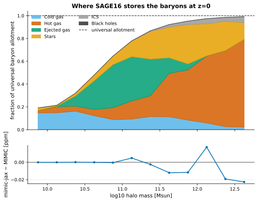

*The physical reservoir inventory and the much smaller MIMIC–mimic-jax catalogue residual.*

## What controls the stellar mass function?

Each curve is E=d ln(phi)/d ln(theta): a value of -0.6 means that a 1% parameter increase lowers the estimated abundance in that bin by about 0.6%. A Gaussian-CDF finite-volume estimator (0.05 dex bandwidth) makes catalogue bin transport differentiable; the SAGE evolution itself is unchanged. Adjacent sign changes often mean that galaxies move between bins, not that their total number changes.

Related: [Fractional responses](../../docs/sensitivity.md)


*Fractional abundance response: percent bin-abundance change per 1% parameter change.*

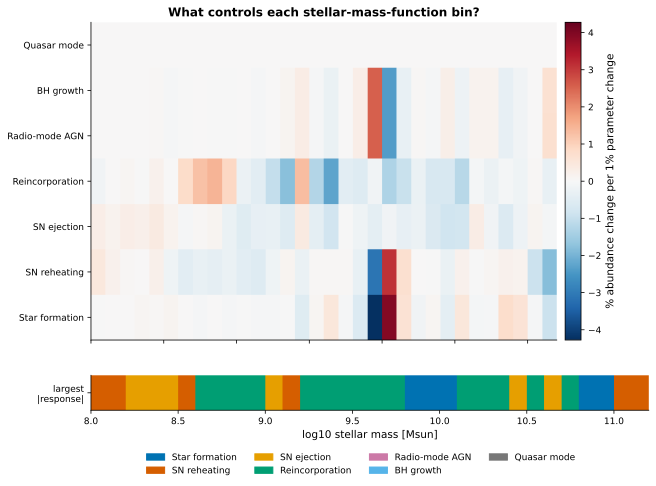

*Signed response heat map with a strip identifying the largest local response magnitude.*

[Parameters arrays](assets/mini-millennium-sage16-parameter-responses.npz) — Machine-readable evidence used to generate this report.

- The soft estimator differs from the hard-bin SMF by a median 3.85% in resolved bins.
- QuasarModeEfficiency has no resolved response in these population summaries; this is a result for this sample and observable set, not a claim that quasar-mode physics is generally irrelevant.

## Which observations constrain which physics?

The response matrix collects familiar population summaries in one view. Influence is not identifiability: a large response says that a parameter matters, while a distinct column pattern says that the available observables can tell it apart from others.

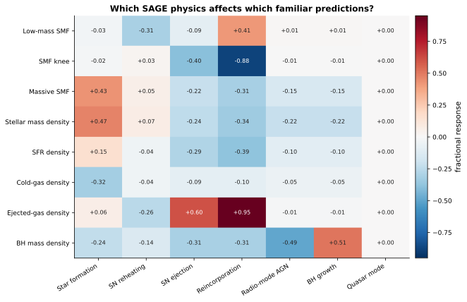

*Observable-by-parameter fractional response matrix for familiar population summaries.*

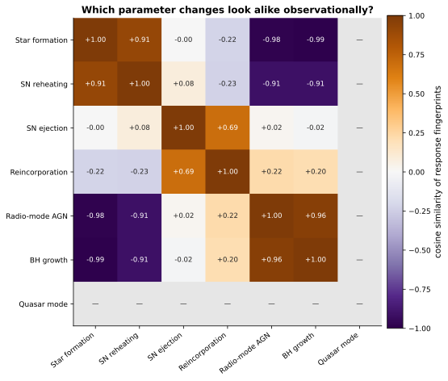

*Cosine similarity between the observable response fingerprints of parameter pairs.*

- A similarity near +1 means two parameter changes move the current observables in nearly the same direction; -1 means opposite directions.
- Undefined similarity marks a zero response vector, rather than silently assigning similarity zero.

## When does each baryonic process matter?

Each cell is the percentage change in mean z=0 stellar mass caused by making one physical transfer 1% stronger during a finite epoch. Epochs are uniform in ln(a) and displayed with redshift labels, so the response is dimensionless and independent of a per-time versus per-redshift plotting convention.

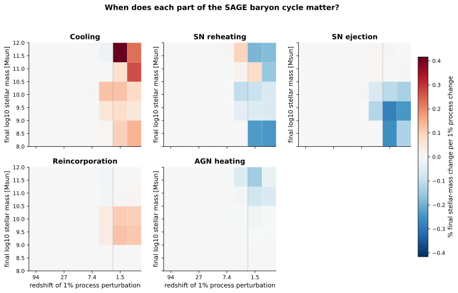

*Finite-epoch process responses of mean present-day stellar mass, stratified by final stellar mass.*

[History arrays](assets/mini-millennium-sage16-history-responses.npz) — Machine-readable evidence used to generate this report.

- The five final-mass bins contain 12, 12, 12, 12, and 3 selected central galaxies; the highest-mass row is exploratory.
- Thresholds, merger/event branches, and finite sample selection make the exact SAGE map piecewise differentiable.

## Where does AGN regulation take over from cooling?

In the selected massive histories, extra cooling raises final stellar mass while extra AGN heating lowers it, with the largest measured leverage in the z≈2.36–0.83 epoch. This is the desired direct SAGE statement, but the highest-mass sample is small and a 1% cooling intervention can cross a non-smooth branch; the local response is validated by the converged 0.1% test.

Related: [Radio-mode heating](../../docs/radio_mode_heating.md)

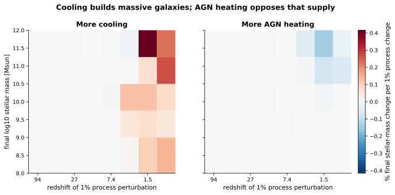

*Paired cooling and AGN-heating responses across final stellar mass and epoch.*

## When does galaxy growth decouple from halo growth?

Median logarithmic halo and stellar growth rates are followed along the selected main histories. The figure is a measured descriptive diagnostic; connecting each separation causally to AGN, cooling, or mergers requires the adjacent process-response maps.

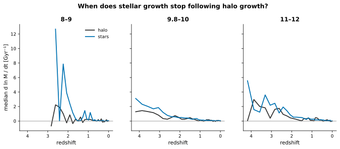

*Median logarithmic halo and stellar growth rates along selected main histories.*

## Does the continuous framework converge in time?

Yes for the tested smooth intervals. The Dormand–Prince 5(4) controller estimates local truncation error and limits each step using the tolerance-scaled state Jacobian. Tightening the tolerance reduces both reservoir and stellar-mass errors against an independent 4,096-step RK4 reference while preserving the baryon transfer invariant.

Related: [Numerical integration](../../docs/numerical_integration.md)

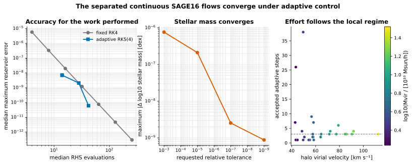

*Accuracy, stellar-mass convergence, and per-galaxy adaptive work for smooth continuous SAGE16 intervals.*

[Adaptive summary](assets/mini-millennium-sage16-adaptive-continuous.json) — Machine-readable evidence used to generate this report.

[Adaptive arrays](assets/mini-millennium-sage16-adaptive-continuous.npz) — Machine-readable evidence used to generate this report.

- All 27 retained z=0 central-galaxy intervals succeeded at every tested tolerance from 1e-3 to 1e-9; 25 candidates were excluded because the reference trajectory crossed a reservoir boundary, the quiescent-star-formation threshold, or the cooling-regime threshold.
- At rtol=1e-7 the maximum stellar-mass difference is 2.54e-09 dex, the median/maximum relative reservoir errors are 2.10e-09/6.00e-07, and the largest baryon residual is 2.22e-16.
- The SfrEfficiency derivative through the adaptive solve agrees with three symmetric finite differences to 8.31e-07 relative error.
- The raw Jacobian norm is unit-dependent. The controller therefore uses D^-1(∂f/∂x)D, with D set by the same absolute/relative error scales used by the local error estimate.
- This establishes convergence of the separated continuous flows under fixed halo forcing. It does not yet establish full-tree adaptive convergence across threshold crossings, halo-forcing changes, mergers, disk-instability projections, or the history-dependent Rheat projection.

## Does the timestep change familiar science?

The exact upstream-sequential update remains the equivalence reference. Here only its internal baryonic substep count is refined under the same piecewise-constant merger-tree forcing. The sequence does not converge cleanly through 80 substeps because SubSteps also changes the repeated realization of finite stripping, threshold, and event maps; this is precisely why rate flows and genuine maps must be separated in the hybrid model.

Related: [Numerical integration](../../docs/numerical_integration.md)

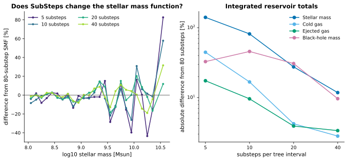

*Population-level timestep effects shown through the SMF and integrated reservoir totals.*

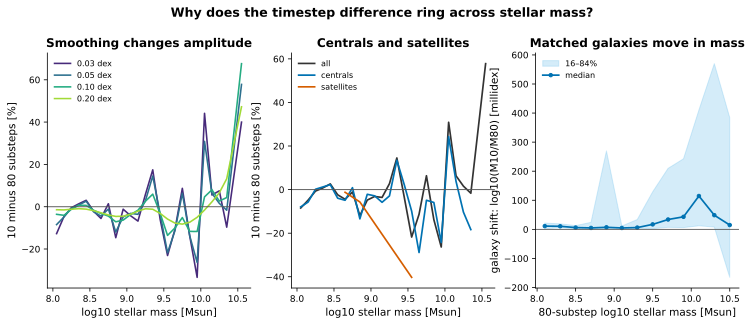

*Matched-galaxy diagnosis of the oscillatory stellar-mass-function timestep residual.*

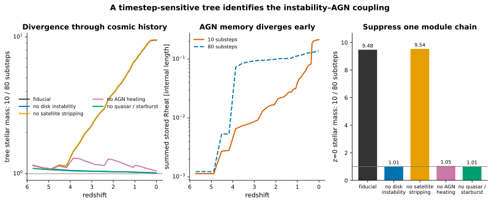

*Single-tree module ablation identifies the hybrid process chain that amplifies timestep sensitivity.*

[Convergence summary](assets/mini-millennium-sage16-convergence-500.json) — Machine-readable evidence used to generate this report.

[Ringing arrays](assets/mini-millennium-sage16-timestep-ringing.npz) — Machine-readable evidence used to generate this report.

[Module Ablation arrays](assets/mini-millennium-sage16-timestep-module-ablation.npz) — Machine-readable evidence used to generate this report.

- The 500 trees are spread across the complete partition and resolve log10 stellar mass 8.05–10.55; the rarer massive tail remains unresolved.
- The five-resolution experiment, including an intentionally coarse five-substep run, took 653.8 s on this CPU. The complete seven-parameter response of all 2,864 trees took 433.3 s.
- The apparent ringing is a mass-coordinate residual, not a measured oscillation in cosmic time. At 0.05 dex smoothing the median 10-to-80 difference is 4.81% overall, 5.31% for centrals, and 5.68% for satellites.
- Matched galaxies shift by a median 9.80 millidex between 10 and 80 substeps. Coherent movement through a finite, structured mass distribution produces alternating excess/deficit lobes at fixed mass; the diagnostic does not by itself isolate which finite map drives the movement.
- Common galaxy identities account for 100.00% of the change in total stellar mass.
- A deliberately sensitive 88-halo tree provides process attribution, not a population average. Its z=0 10/80 stellar-mass ratio is 9.48; it becomes 1.012 without disk instability, 1.012 without its quasar/starburst consumers, and 1.047 without AGN heating.
- Suppressing satellite stripping leaves the same tree's ratio at 9.54. This isolates the strong amplification to the disk-instability → burst/BH-growth → AGN chain in this case, while the remaining percent-level offset is the wider sequential-flow/threshold error.
- At z=2.07, the summed stored AGN heating radius is 5.9 times larger in the 80-substep history. The persistent Rheat projection therefore records the early branch divergence and suppresses later cooling even though the coarse history ends with the larger black hole.

## Why trust the new derivatives?

The tangent calculation differentiates the same fixed-topology sequential SAGE map and propagates derivatives through tree inheritance. Explicit plus/minus reruns validate representative parameter directions; history responses are reported with their stricter piecewise-smooth caveat.

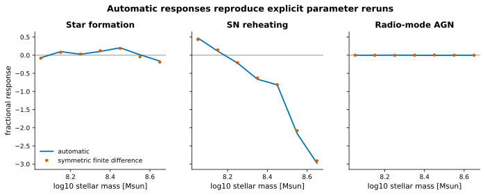

*Automatic fractional responses compared with explicit symmetric 1% parameter reruns.*

[Parameter Validation summary](assets/mini-millennium-sage16-response-validation-1000.json) — Machine-readable evidence used to generate this report.

### Do finite epoch reruns approach the local response?

**Status:** ✅ Passed

At 0.1%, the largest cooling/AGN response error is 0.0052; the error decreases as the intervention shrinks.

**Acceptance criterion:** maximum absolute response error <= 0.01

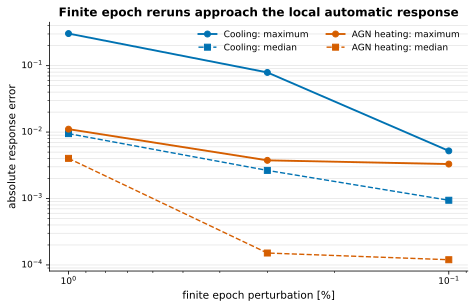

*Cooling and AGN finite-epoch reruns converge toward the local automatic response as perturbations shrink.*

[History Validation summary](assets/mini-millennium-sage16-history-validation.json) — Machine-readable evidence used to generate this report.

## What remains outside this report?

The report does not fabricate missing science. Cosmic SFR evolution, gas and metallicity relations, BH–bulge response curves, quenched fractions, uncertainty propagation with a defensible parameter covariance, environment, and clustering remain subsequent population products.

## Parameters

| Parameter | Value | Units | Description |
| --- | ---: | --- | --- |
| `GlobalBaryonFraction` | 0.17 | dimensionless |  |
| `SfrEfficiency` | 0.05 | dimensionless | Quiescent star-formation efficiency per disk dynamical time. |
| `StarFormingDiskFactor` | 3 | dimensionless |  |
| `FeedbackReheatingEpsilon` | 3 | dimensionless | Supernova reheating normalization. |
| `FeedbackEjectionEfficiency` | 0.3 | dimensionless | Supernova energy efficiency for halo-gas ejection. |
| `ReIncorporationFactor` | 0.15 | dimensionless | Return rate of ejected gas to the hot halo. |
| `AGNrecipe` | 2 | dimensionless |  |
| `RadioModeEfficiency` | 0.08 | dimensionless | Radio-mode black-hole accretion/heating efficiency. |
| `BlackHoleGrowthRate` | 0.015 | dimensionless | Cold-gas black-hole growth efficiency during events. |
| `QuasarModeEfficiency` | 0.005 | dimensionless | Quasar-mode gas-ejection efficiency. |
| `RecycleFraction` | 0.43 | dimensionless |  |
| `Yield` | 0.025 | dimensionless |  |
| `FracZleaveDisk` | 0 | dimensionless |  |
| `ThresholdMajorMerger` | 0.3 | dimensionless |  |
| `ThresholdSatDisruption` | 1 | dimensionless |  |

## Provenance and reproducibility

| Item | Value |
| --- | --- |
| Generated | 2026-08-18T17:12:32Z |
| Git commit | `0a409c970936c83057d905b6e297666df5c10ead` (dirty working tree) |
| Git branch | main |

### Rerun command

```shell
python examples/build_mini_millennium_science_report.py
```

### Configurations and inputs

| Role | Path | SHA-256 | Bytes |
| --- | --- | --- | ---: |
| configuration | `models/sage16/input/sage16_mini-millennium.yaml` | `9e1e5212817ee324a9c13e3b1faa86aec1b2979571c0655f070cd6c234e39cf1` | 3747 |
| input | `archive/mini-millennium-partition-1-science.json` | `137c8b29aa42ac4d7cee031fae3a6b75d490eedf743c48748ea67ea79dd202c4` | 2658 |
| input | `archive/mini-millennium-partition-1-science.npz` | `3d81a5dfd5c79c61725484076319098f5f3a6d8a23eb4dd95ce0921e47f49f5c` | 14410 |
| input | `archive/mini-millennium-sage16-parameter-responses.json` | `f08fcde5f6d706863eddc2fa1156401fb098608a561b7857e83775d09fc6ae1f` | 1619 |
| input | `archive/mini-millennium-sage16-parameter-responses.npz` | `d154cbeee740a2fabf4bbe47a61d3220b0acc25ce1c5c653c024097b586b72fb` | 11947 |
| input | `archive/mini-millennium-sage16-response-validation-1000.json` | `309acb8e6c4c2a0e6591ec546df711cf42081f7f7d1b02fa00211d142fb43ec2` | 1771 |
| input | `archive/mini-millennium-sage16-response-validation-1000.npz` | `886a20ecc87e47f6e18764e18054ca3c0a26f74c4d1814dfeda7306a6390c264` | 13804 |
| input | `archive/mini-millennium-sage16-history-responses.json` | `720a7b4845a83473c7c9ad9e0a881fda85f019561c94ba3d15b3ffe92f653782` | 2393 |
| input | `archive/mini-millennium-sage16-history-responses.npz` | `e3523a4abc9ea529c089e5db852d879136a6fcee82fc1fa69360ab5f6b53b7c6` | 21176 |
| input | `archive/mini-millennium-sage16-history-validation.json` | `24c18426191001e379e41755a5cff2699fee1e4d9d6f4a6ac7b6fe33a05075f1` | 1346 |
| input | `archive/mini-millennium-sage16-history-validation.npz` | `327efb3a42975fbd20b4bb8d891e1b33602814f74c8a67099b315024724b56e5` | 2579 |
| input | `archive/mini-millennium-sage16-convergence-500.json` | `41685b47726567d168a8b6ee65b6442d2c5110f036922b4cc2a3f117b0c37a0d` | 1303 |
| input | `archive/mini-millennium-sage16-convergence-500.npz` | `cfc3e00cbaeac76ad43bdf3c2cb1cd854875b6d1b4051fe0c7905bf27ec9bbd4` | 7472 |
| input | `archive/mini-millennium-sage16-timestep-ringing.json` | `a2bb1890905c92280a5502da947552e7b0e6b0fd0a8e324df2f929f18430a2ed` | 1930 |
| input | `archive/mini-millennium-sage16-timestep-ringing.npz` | `e5bdf32750d5b5012821320b81ffbdec77b02f20079f84213f7701e6c5586309` | 35479 |
| input | `archive/mini-millennium-sage16-timestep-module-ablation.json` | `565d94a00015353f617ca87947adadde0c1716d5daab7c199efe626363a41871` | 1724 |
| input | `archive/mini-millennium-sage16-timestep-module-ablation.npz` | `6e1c360f9322af1bcca4fca7aa3e9af9c14430a01342f43e8720689104e976cb` | 17757 |
| input | `archive/mini-millennium-sage16-adaptive-continuous.json` | `27bb07a9088694a0f96e53267859f5ef33d59d748df404cf9029fcabeaeed8d4` | 2812 |
| input | `archive/mini-millennium-sage16-adaptive-continuous.npz` | `0b60088ac42445d5755e2cdb8e9e430c85d65a338e2d98516a40f2afc09db62f` | 26353 |
| input | `simulations/mini-millennium/mini-millennium.a_list` | `2866412ae276939c625afef8a92a1da442fcc4bd8490dda191f38a0f5028164f` | 577 |

### Software

| Name | Value |
| --- | --- |
| PyYAML | 6.0.3 |
| h5py | 3.14.0 |
| jax | 0.4.30 |
| jaxlib | 0.4.30 |
| matplotlib | 3.9.4 |
| numpy | 2.0.2 |
| python | 3.9.6 |

### Hardware and backend

| Name | Value |
| --- | --- |
| jax_backend | cpu |
| jax_devices | ['TFRT_CPU_0'] |
| machine | arm64 |
| processor | arm |
| release | 25.6.0 |
| system | Darwin |
