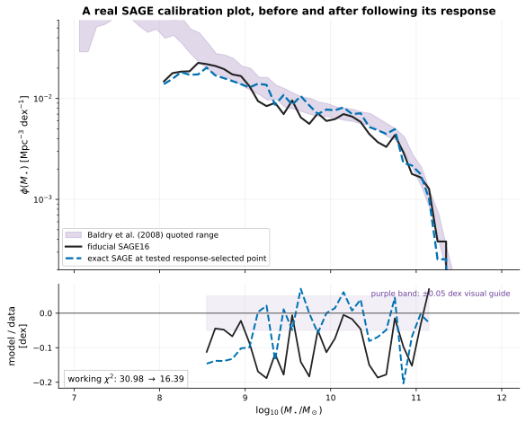
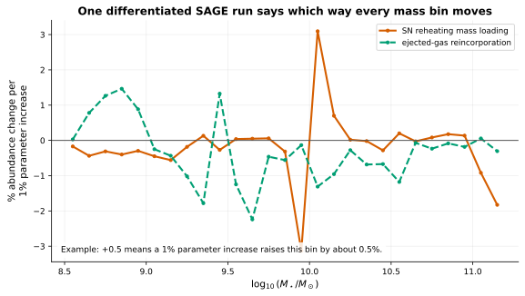
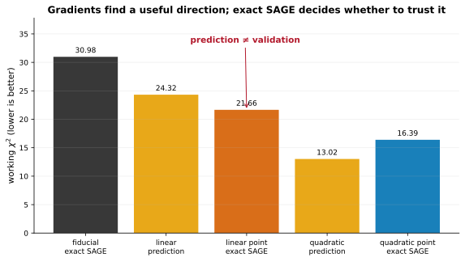
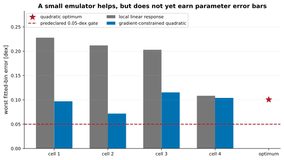
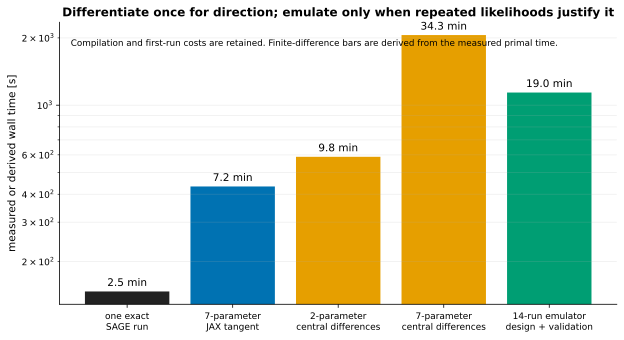
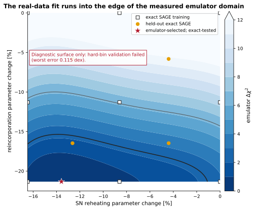

# Fit SAGE with gradients: what one stellar mass function can—and cannot—constrain

A practitioner-facing comparison of JAX response fitting, exact SAGE validation, local curvature, MCMC, and a deliberately failed first surrogate.

[Machine-readable manifest](report.json)

## Run overview

| Item | Value |
| --- | --- |
| Model | fiducial SAGE16 with two varied physical parameters |
| Dataset / trees | Mini-Millennium partition 1 + Baldry et al. (2008) z≈0 stellar mass function |
| Parameter set | SN reheating and reincorporation varied in log space |
| Integration method | exact upstream-sequential differentiable tree map |
| Fitted SMF bins | 27 |
| Merger trees | 2864 |
| Fiducial working chi-square | 30.9791 |
| Selected exact-run chi-square | 16.3938 |
| Worst held-out emulator error | 0.115359 dex |

Related: [Mini-Millennium science program](../mini-millennium-sage16-science-program/index.md) · [Fractional response API](../../docs/sensitivity.md) · [Report architecture](../../docs/reporting.md)

## Run health

| Check | Status | Evidence |
| --- | --- | --- |
| Reference SAGE16 status | ✅ Passed | The underlying complete-partition path is the previously validated upstream-sequential SAGE16 map; this application changes parameters, not the physics implementation. |
| Parameter-response validation | ✅ Passed | The baseline seven-parameter SAGE response used here was previously checked against symmetric full-tree reruns to <=0.078 absolute elasticity error in resolved bins. |
| Exact SAGE fit improvement | ✅ Passed | The exact evaluated SAGE point lowers the stated working chi-square by 47.1% relative to fiducial. |
| Surrogate validation | ❌ Failed | The gradient-constrained quadratic emulator failed the predeclared hard-SMF validation gate, so it is not accepted for scientific parameter intervals. |
| Final parameter error bars | ❌ Failed | Unavailable: the optimum reaches the reincorporation design boundary and the emulator fails validation. Local curvature numbers are retained only as a forecast/diagnostic. |
| Continuous full-tree inference | ⬚ Not evaluated | The adaptive continuous/hybrid RHS is not yet a complete validated population driver through all merger-tree events; this report therefore uses the exact differentiable reference tree map. |

## At a glance



*Baldry et al. stellar mass function, fiducial SAGE16, and the exact evaluated response-selected point.*



*Fractional bin-abundance response to SN reheating and reincorporation.*



*Working chi-square for fiducial, response predictions, and their exact SAGE evaluations.*



*Worst hard-bin residual at every predeclared held-out point and at the proposed optimum.*

## What did we learn?

The evidence supports a useful fit direction and local precision forecast, but not final observational parameter intervals.

- The exact SAGE point selected by the small response model reduces the working chi-square from 30.98 to 16.39 (47.1%).
- The first derivative-only proposal already reaches chi-square 21.66, showing that one tangent calculation identifies a useful physical direction.
- At fiducial, the diagonal working likelihood has local log-parameter widths of 4.5% and 4.8%, with response correlation +0.28; these are forecasts, not final error bars.
- The seven-parameter JAX tangent cost 7.2 min, about 4.8× less than fourteen central-difference SAGE runs at the measured primal time.
- The emulator's worst held-out hard-SMF error is 0.115 dex, above the 0.05-dex gate, so final error bars remain unavailable.

## Can SAGE move closer to a real calibration observation?

Yes. The exact selected SAGE run moves the familiar z≈0 stellar mass function substantially closer to the Baldry et al. observational band under the stated working likelihood.

The observation is the same Baldry, Glazebrook & Driver (2008) table used by the upstream-style SAGE plot. We fit 27 bins from log10(M*/Msun)=8.5 to 11.15, require at least ten fiducial model galaxies per bin, and freeze the covariance before fitting.

The covariance is deliberately simple: the quoted observational width is treated as diagonal Gaussian uncertainty in ln(phi), with a fixed 1/N Mini-Millennium counting term. It omits observational covariance, stellar-mass systematics, cosmic variance beyond Poisson noise, and model discrepancy. Those omissions make this a workflow demonstration, not a publishable SAGE recalibration.

Related: [Baldry et al. 2008](https://arxiv.org/abs/0804.2892) · [SAGE16 calibration paper](https://arxiv.org/abs/1601.04709)


*Baldry et al. stellar mass function, fiducial SAGE16, and the exact evaluated response-selected point.*

## What does one differentiated SAGE run buy?

It returns the fractional movement of every fitted mass bin with respect to every selected parameter, so the optimizer receives direction and scale simultaneously.

The plotted quantity is $E_{\alpha i}=\partial\ln\phi_\alpha/\partial\ln\theta_i$. A value of −0.6 means that increasing the parameter by 1% lowers abundance in that mass bin by about 0.6% near the fiducial model.

A two-sided finite difference needs two complete SAGE runs per parameter. The existing seven-parameter tangent pass carries all seven directions through one tree traversal. It is not free—forward tangents cost more than one primal run—but the measured cost is still far below fourteen separate reruns.


*Fractional bin-abundance response to SN reheating and reincorporation.*



*Measured tangent/primal times and transparently derived finite-difference costs.*

## Can we simply follow the gradient to the best fit?

It gives a good first proposal, but exact SAGE validation is essential because thresholds, events, and hard population bins make the finite move nonlinear.

The first local solve proposes 0.947× the fiducial SN reheating parameter and 0.885× the reincorporation factor. That exact SAGE run improves the fit, but individual hard-SMF bins differ from the linear prediction by as much as 0.114 dex, failing the predeclared 0.05-dex gate.

This is not a failure of automatic differentiation: the derivative is local and was separately finite-difference validated. It is a failure of treating that local derivative as a global surrogate across a finite parameter step.


*Working chi-square for fiducial, response predictions, and their exact SAGE evaluations.*

### Parameter-response validation

**Status:** ✅ Passed

The baseline seven-parameter SAGE response used here was previously checked against symmetric full-tree reruns to <=0.078 absolute elasticity error in resolved bins.

**Method:** JAX chain-rule tangent versus symmetric multiplicative SAGE reruns

**Acceptance criterion:** absolute elasticity error <= 0.1 in resolved bins

## Should we build an emulator as part of the same workflow?

Yes in principle, because repeated posterior likelihoods are where emulation helps most—but this first small emulator is not yet accurate enough for the conventional hard-bin SMF.

The test uses a fixed 3×3 design in the two logarithmic parameters. Eight new exact SAGE runs supply curvature; the fiducial value and JAX elasticity are imposed exactly. Four cell centers and the optimizer-selected point are held out from training.

The quadratic emulator halves the worst error relative to a purely local response, but its 0.115-dex worst bin still exceeds the 0.05-dex contract. A smoother finite-volume SMF behaves better, suggesting that much of the remaining difficulty is hard-bin migration, but that post-hoc observation does not override the declared gate.

The next emulator should use a denser/adaptive design, multiple Mini-Millennium partitions, and a validation metric matched to the explicitly differentiable population estimator. A neural network is not required for this two-parameter problem; the validation design matters more than model fashion.

Related: [GALFORM emulator example (Elliott et al. 2021)](https://arxiv.org/abs/2103.01072) · [Meraxes/PRISM emulator example (van der Velden et al. 2020)](https://arxiv.org/abs/2011.14530)


*Worst hard-bin residual at every predeclared held-out point and at the proposed optimum.*

[Differentiable calibration arrays](assets/mini-millennium-sage16-differentiable-calibration.npz) — Observation, response, exact SAGE design, held-out residuals, fit geometry, and MCMC samples.

### Surrogate validation

**Status:** ❌ Failed

The gradient-constrained quadratic emulator failed the predeclared hard-SMF validation gate, so it is not accepted for scientific parameter intervals.

**Acceptance criterion:** maximum absolute hard-SMF error <= 0.05 dex at all held-out points

| Quantity | Value | Interpretation |
| --- | ---: | --- |
| Worst held-out bin error | 0.115359 dex |  |
| Acceptance gate | 0.05 dex |  |

## What parameter values and error bars can we report?

We can report the direction and exact evaluated improvement. We cannot yet report validated final two-sided observational error bars.

| SAGE parameter | Physical role | Fiducial | First gradient proposal | Best evaluated direction | Fiducial local 1σ forecast |
|---|---|---:|---:|---:|---:|
| `FeedbackReheatingEpsilon` | SN reheating mass loading | 3 | 0.947× fiducial | 0.864× fiducial | 4.5% |
| `ReIncorporationFactor` | ejected-gas reincorporation | 0.15 | 0.885× fiducial | 0.787× fiducial | 4.8% |

The best evaluated direction corresponds to SN reheating 2.59 rather than 3.0 and reincorporation 0.118 rather than 0.15. It is shown because exact SAGE was run there, not because the emulator earned a global optimum claim.

The final response surface reaches the lower reincorporation boundary, and the surrogate fails held-out validation. The MCMC percentiles and local Hessian stored in the NPZ are therefore diagnostic only. Adding a narrow prior would produce neat contours, but those contours would describe the prior as much as the stellar mass function.



*Training design, held-out points, and the boundary-selected fit on the rejected quadratic emulator.*

### Final parameter error bars

**Status:** ❌ Failed

Unavailable: the optimum reaches the reincorporation design boundary and the emulator fails validation. Local curvature numbers are retained only as a forecast/diagnostic.

- No unstated Gaussian prior was added to manufacture two-sided constraints.
- The saved MCMC chain samples the rejected emulator and is retained only to diagnose the proposed workflow.

## Does differentiability replace MCMC?

No. It changes how efficiently we find modes, diagnose degeneracies, construct proposals, and build emulators; MCMC still answers the global posterior question when the likelihood is nonlinear or multimodal.

The saved 50,000-step random-walk chain samples exactly the same bounded emulator likelihood as the optimizer. It is retained to make the comparison familiar, but it cannot rescue an invalid emulator.

The practical hybrid workflow is: use JAX gradients to find influential directions and local curvature; run exact SAGE at a designed set of points; validate an emulator; then use MCMC or another sampler on that emulator, with occasional exact checks. Gradient-based optimization and MCMC answer different questions.

For context, MCMC calibration has a long history in SAMs; Henriques et al. (2009) used it to expose strong parameter correlations. Differentiability adds information per SAGE run, not permission to skip posterior validation.

Related: [Henriques et al. 2009 MCMC SAM calibration](https://arxiv.org/abs/0810.2548)

## Which observations should constrain the next parameters?

The stellar mass function alone should not be asked to identify every SAGE process. The next application should add the real observables SAGE16 was calibrated against.

Croton et al. (2016) show the z≈0 stellar mass function together with the baryonic Tully–Fisher relation, the mass–metallicity relation, and the black-hole–bulge relation. These observables have complementary physical leverage:

- baryonic Tully–Fisher and gas statistics constrain star formation and feedback without using abundance alone;
- mass–metallicity adds leverage on metal production and outflows;
- black-hole–bulge data are required before expecting radio/quasar parameters to be identifiable;
- cosmic SFR history tests whether a z=0 fit achieved the right assembly path rather than only the right endpoint.

The response-matrix API already supplies the mathematical object needed to quantify that complementarity. The missing work is a defensible joint covariance and the corresponding differentiable population summaries—not a larger optimizer.

## Why is this not yet the adaptive continuous full-tree fit?

The current adaptive continuous/hybrid formulation is validated on smooth fixed-forcing intervals, but not yet as a complete population driver through every merger, threshold, and projection.

For observational fitting, changing the tree evolution scheme would mix two questions: parameter calibration and numerical reformulation. This first application therefore uses the exact upstream-sequential differentiable map whose Mini-Millennium outputs are already equivalent to MIMIC.

The inference and report APIs are agnostic to that choice. Once the continuous/hybrid full-tree driver passes the same population-equivalence and event-localization gates, it can be substituted as a second model and compared under the identical likelihood. Until then, calling it the fitted SAGE population would overstate what has been validated.

### Continuous full-tree inference

**Status:** ⬚ Not evaluated

The adaptive continuous/hybrid RHS is not yet a complete validated population driver through all merger-tree events; this report therefore uses the exact differentiable reference tree map.

- Using the continuous RHS here would make the implementation request sound complete at the cost of changing the scientific model being fitted.

## Technical validation and reproducibility

Every fit decision, failure gate, exact SAGE point, sampler draw, and observational conversion is retained in durable JSON/NPZ products.

[Differentiable calibration summary](assets/mini-millennium-sage16-differentiable-calibration.json) — Likelihood, fit, validation, runtime, and failure-gate metadata.

[Differentiable calibration arrays](assets/mini-millennium-sage16-differentiable-calibration.npz) — Observation, response, exact SAGE design, held-out residuals, fit geometry, and MCMC samples.

### Reference SAGE16 status

**Status:** ✅ Passed

The underlying complete-partition path is the previously validated upstream-sequential SAGE16 map; this application changes parameters, not the physics implementation.

| Quantity | Value | Interpretation |
| --- | ---: | --- |
| Merger trees | 2864 |  |
| z=0 galaxies | 3595 |  |

- See the linked Mini-Millennium report for field-level and hard-bin equivalence evidence.

### Parameter-response validation

**Status:** ✅ Passed

The baseline seven-parameter SAGE response used here was previously checked against symmetric full-tree reruns to <=0.078 absolute elasticity error in resolved bins.

**Method:** JAX chain-rule tangent versus symmetric multiplicative SAGE reruns

**Acceptance criterion:** absolute elasticity error <= 0.1 in resolved bins

### Exact SAGE fit improvement

**Status:** ✅ Passed

The exact evaluated SAGE point lowers the stated working chi-square by 47.1% relative to fiducial.

| Quantity | Value | Interpretation |
| --- | ---: | --- |
| Fiducial chi-square | 30.9791 |  |
| Exact selected-point chi-square | 16.3938 |  |

- This is a fit to one observational relation under a deliberately simplified diagonal working likelihood, not a new SAGE calibration.

### Surrogate validation

**Status:** ❌ Failed

The gradient-constrained quadratic emulator failed the predeclared hard-SMF validation gate, so it is not accepted for scientific parameter intervals.

**Acceptance criterion:** maximum absolute hard-SMF error <= 0.05 dex at all held-out points

| Quantity | Value | Interpretation |
| --- | ---: | --- |
| Worst held-out bin error | 0.115359 dex |  |
| Acceptance gate | 0.05 dex |  |

### Final parameter error bars

**Status:** ❌ Failed

Unavailable: the optimum reaches the reincorporation design boundary and the emulator fails validation. Local curvature numbers are retained only as a forecast/diagnostic.

- No unstated Gaussian prior was added to manufacture two-sided constraints.
- The saved MCMC chain samples the rejected emulator and is retained only to diagnose the proposed workflow.

### Continuous full-tree inference

**Status:** ⬚ Not evaluated

The adaptive continuous/hybrid RHS is not yet a complete validated population driver through all merger-tree events; this report therefore uses the exact differentiable reference tree map.

- Using the continuous RHS here would make the implementation request sound complete at the cost of changing the scientific model being fitted.

- The design and validation points were fixed before the final exact checks.
- The observational table is now a single repository data product shared with the upstream-style plotting routine.
- The report generator does not rerun SAGE; it consumes the archived scientific products.

## Provenance and reproducibility

| Item | Value |
| --- | --- |
| Generated | 2026-08-19T13:43:09Z |
| Git commit | `48b246233a478a4baf34ab6d5036bd010599dd7a` (dirty working tree) |
| Git branch | main |

### Rerun command

```shell
/Users/tabel/Projects/mimic-jax/.venv/bin/python examples/build_sage16_differentiable_calibration_report.py --input-json archive/mini-millennium-sage16-differentiable-calibration.json --input-arrays archive/mini-millennium-sage16-differentiable-calibration.npz
```

### Configurations and inputs

| Role | Path | SHA-256 | Bytes |
| --- | --- | --- | ---: |
| input | `archive/mini-millennium-sage16-differentiable-calibration.json` | `ba7cd4b854d7bc60d8ae82a74510adc254821b9245137d16294578452c9a527e` | 4402 |
| input | `archive/mini-millennium-sage16-differentiable-calibration.npz` | `e6f2e91473c5f699cf825997295567e376e1e0ff5f9725e2477d123db643e9b0` | 180205 |
| input | `data/observations/baldry2008_stellar_mass_function.csv` | `8775324d2e2eb732a77eaf9ac6102d3ca1422a23bbc81e3f2c2ad4ea894d253b` | 1612 |
| input | `simulations/mini-millennium/snapshots/trees_063.1` | `4ca40244b16cdd88cefdf0e2b3198ecb9b76960a72bd144afbddf4cb40920be4` | 15737928 |
| input | `archive/mini-millennium-sage16-parameter-responses.npz` | `d154cbeee740a2fabf4bbe47a61d3220b0acc25ce1c5c653c024097b586b72fb` | 11947 |

### Software

| Name | Value |
| --- | --- |
| h5py | 3.16.0 |
| jax | 0.4.38 |
| jaxlib | 0.4.38 |
| matplotlib | 3.11.1 |
| mimic-jax | 0.1.0 |
| numpy | 2.5.2 |
| python | 3.13.0 |

### Hardware and backend

| Name | Value |
| --- | --- |
| jax_backend | cpu |
| jax_devices | ['TFRT_CPU_0'] |
| machine | arm64 |
| processor | arm |
| release | 25.6.0 |
| system | Darwin |

### Random seeds

| Name | Value |
| --- | --- |
| mcmc | 481516 |
