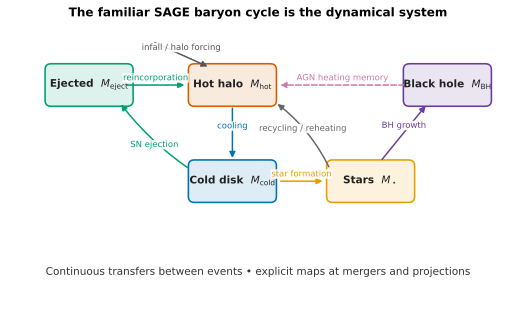
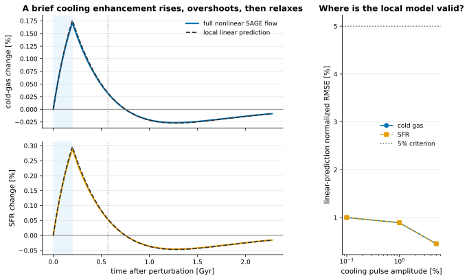
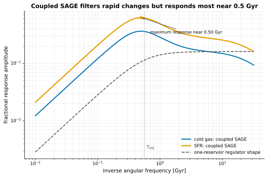
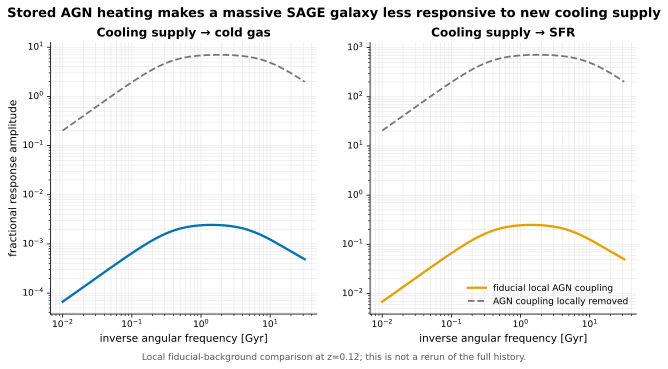
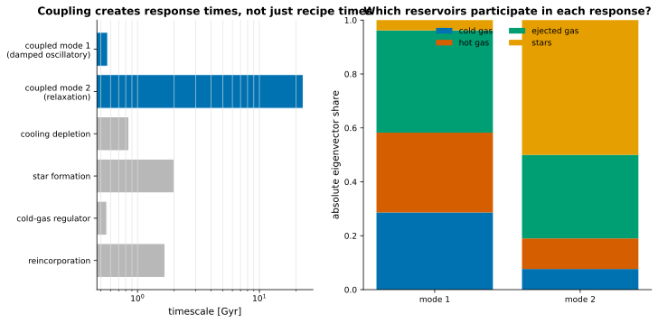
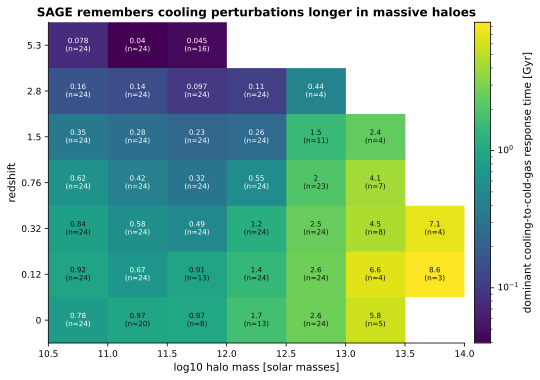
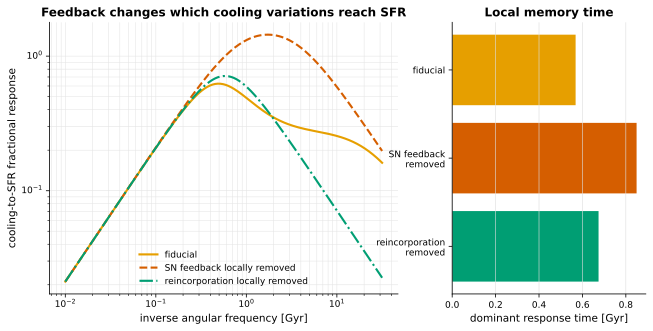
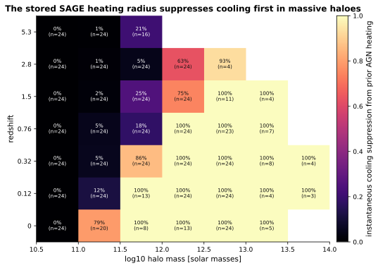
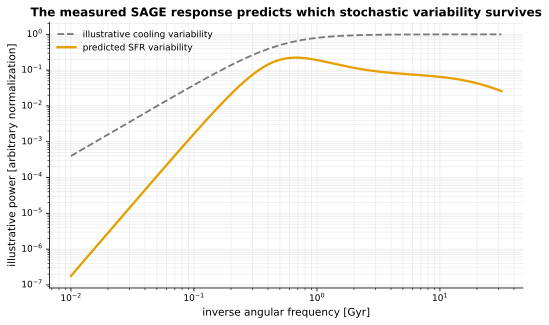

# How long does SAGE remember?

A practitioner-facing measurement of how SAGE16 responds to changes in gas supply, which reservoirs set its response times, and how stored AGN heating changes that response.

[Machine-readable manifest](report.json)

## Run overview

| Item | Value |
| --- | --- |
| Model | fiducial SAGE16 |
| Dataset / trees | Mini-Millennium partition 1; 96 stratified trees at 7 epochs |
| Parameter set | fiducial |
| Integration method | upstream-sequential trajectory; frozen local continuous RHS |
| Local trajectory points | 915 |
| Sampled epochs | 7 |
| Representative cooling memory | 0.568653 Gyr |
| Science analysis wall time | 132.753 s |

Related: [Mini-Millennium science program](../mini-millennium-sage16-science-program/index.md) · [Initial equivalence report](../mini-millennium-sage16-initial/index.md) · [Machine-readable response arrays](assets/mini-millennium-sage16-linear-response.npz)

## Run health

| Check | Status | Evidence |
| --- | --- | --- |
| Upstream SAGE16 equivalence | ⬚ Not evaluated | Not rerun by this local-response analysis; the same physics core is validated in the linked Mini-Millennium report. |
| Local nonlinear-response validation | ✅ Passed | For the representative 1% cooling pulse, the maximum cold-gas/SFR normalized RMSE is 0.89%. |
| Hybrid event boundary | ⚠️ Warning | The local AGN flow reads the stored heating radius, but its monotone Rheat projection and genuine mergers remain explicit maps outside each frozen transfer function. |
| Conservation in this analysis | ⬚ Not evaluated | This report reuses the structurally conservative RHS but does not repeat the separate baryon/metal conservation campaign. |

## At a glance



*SAGE16 reservoirs and transfers, with continuous flows distinguished from hybrid maps.*



*A 1% nonlinear cooling pulse compared with the frozen local prediction and an amplitude-sweep validity test.*



*Fractional cold-gas and SFR response versus inverse angular frequency in Gyr.*



*Cooling-to-cold-gas and cooling-to-SFR gain at one fiducial massive state, with the local AGN coupling retained or removed.*

## What did SAGE tell us?

These findings are computed from the archived response arrays and are deliberately phrased as galaxy-formation results, not as claims about mathematical technique.

- A 1% cooling pulse in the representative z=0.32 central is reproduced by the local model to 0.89% normalized RMSE and has a dominant response time of 0.57 Gyr.
- The local cold-gas-regulator recipe estimate is 0.56 Gyr, close to the strongest coupled mode at 0.57 Gyr; a weaker 22.9 Gyr collective mode is also present in this operating point.
- The coupled cooling-to-SFR response peaks near inverse angular frequency 0.50 Gyr at 3.9 times its very-slow gain, so the actual local baryon cycle is more structured than a one-reservoir low-pass regulator.
- At the same fixed SAGE state, locally suppressing SN reheating/ejection changes the dominant response time from 0.57 to 0.85 Gyr, while suppressing reincorporation changes it to 0.67 Gyr.
- Across the stratified trajectory survey, the median dominant cooling-memory time spans 0.04–8.62 Gyr across the resolved mass/redshift cells.
- At the selected massive fiducial state, retained AGN heating suppresses the slow cooling-to-SFR gain by 99.98% relative to locally removing the AGN coupling.

## A familiar SAGE galaxy

The starting point is the SAGE16 baryon cycle: familiar reservoirs connected by familiar prescriptions, with the merger tree supplying the halo history.

Between genuine events, the implemented continuous subset can be written schematically as

$$\dot{x}=f(x,h(t),\theta),$$

where $x$ contains the hot, cold, ejected, stellar, and metal reservoirs and $h(t)$ is the halo/tree forcing. Mergers, topology changes, threshold projections, and the stored AGN-heating-radius update remain explicit maps $x^+=J(x^-)$. Nothing in this notation replaces a SAGE prescription; it only makes the transfers explicit.

Related: [Hybrid SAGE16 structure](../../docs/sage16_hybrid_system.md) · [Mini-Millennium science report](../mini-millennium-sage16-science-program/index.md)


*SAGE16 reservoirs and transfers, with continuous flows distinguished from hybrid maps.*

## How long does a SAGE galaxy remember extra cooling?

A temporary 1% increase in the cooling transfer raises cold gas and SFR, then the coupled baryon cycle erases the perturbation on a measured 0.57 Gyr dominant timescale.

We perturb the faithful cooling rate as $\dot M_{\rm cool}\rightarrow\dot M_{\rm cool}\exp(\epsilon)$ for a finite interval. The solid curves are two full nonlinear SAGE-flow evolutions—perturbed minus unperturbed—under the same frozen halo forcing. The dashed curves are predicted from the Jacobian at the initial fiducial state.

The impulse response, or Green function, is $g(t)=\mathcal{L}^{-1}\{H(s)\}$: it says how the influence of an infinitesimal parcel-like perturbation propagates into later observables. A sustained step integrates that response. The finite rectangular pulse plotted here is the difference between a step beginning at $t=0$ and the same step beginning when the cooling enhancement ends.

The right panel is the quantitative validity test. A 1% intervention is small enough for the local model here; this is measured rather than assumed. The decreasing relative error at 5% occurs for this finite pulse and normalization and must not be read as a general extension of the linear regime.


*A 1% nonlinear cooling pulse compared with the frozen local prediction and an amplitude-sweep validity test.*

## Which variations in gas supply reach the SFR?

Rapid cooling variations are attenuated, but the actual coupled response is not a featureless low-pass filter: the SFR gain reaches a maximum near inverse angular frequency 0.50 Gyr, 3.9 times its very-slow value.

The simplest local cold-gas regulator is $\dot M_{\rm cold}=\dot M_{\rm cool}-(1-R+\eta)\psi$ with $\psi\simeq M_{\rm cold}/\tau_\star$. Its equilibration time is $\tau_{\rm eq}=\tau_\star/(1-R+\eta)$. Taking the Laplace transform replaces the time derivative by multiplication by $s$ and gives the cooling-to-SFR response

$$\frac{\Psi(s)}{\dot M_{\rm cool}(s)}=\frac{1/\tau_\star}{s+1/\tau_{\rm eq}}.$$

The horizontal coordinate is $1/\omega$ in Gyr, not abstract angular frequency. Moving right means asking about progressively slower supply variations. The dashed one-reservoir curve is shape-matched at low frequency; the solid curves come from the actual coupled SAGE Jacobian. Their intermediate-timescale maximum and the pulse undershoot are the signature of the damped coupled mode measured in the next section. This is a result SAGE supplies; it is not inserted by the transform.


*Fractional cold-gas and SFR response versus inverse angular frequency in Gyr.*

## Which reservoirs set the galaxy response time?

The coupled SAGE timescales need not equal any one timescale written into a recipe. The strongest local response closely follows the regulator estimate here, while a much slower, weakly coupled collective mode also appears.

Around the actual nonlinear trajectory $x_0(t)$, write $x=x_0+\delta x$. On a branch where the prescriptions are differentiable,

$$\delta\dot{x}=A(t)\,\delta x+B(t)\,\delta u,\qquad A=\left.\frac{\partial f}{\partial x}\right|_{x_0},\quad B=\left.\frac{\partial f}{\partial u}\right|_{x_0}.$$

For coefficients frozen at one epoch, stable poles $s_k=\operatorname{eig}(A)$ give decay times $\tau_k=-1/\Re(s_k)$. Two neutral directions are present in this eight-state representation and are not assigned finite forgetting times. The mode bars show the absolute shares of the mass-reservoir components; metal components enter the eigenproblem but are omitted from the composition display so the baryonic transport remains readable.



*Coupled local modes compared with prescription timescales and decomposed by reservoir participation.*

## How does galaxy memory change with halo mass and epoch?

The dominant local cooling-to-cold-gas response generally becomes longer toward larger halo mass and later cosmic time in the cells resolved by this stratified survey.

Each cell is the median decay time of the stable mode with the largest cooling-to-cold-gas residue. The sample deliberately combines uniform tree coverage with the largest trees and caps each mass/snapshot cell; it is a trajectory diagnostic, not an abundance-weighted Mini-Millennium statistic. Cells require at least three retained centrals, and counts are printed in the map.

Because $A=A[x(t),h(t)]$, this is a sequence of local frozen-coefficient measurements, not one transfer function for a galaxy from high redshift to $z=0$.



*Median dominant cooling-to-cold-gas response time; every displayed cell includes its retained sample count.*

[Linear-response scientific arrays](assets/mini-millennium-sage16-linear-response.npz) — Pulse responses, transfer functions, poles, mode compositions, and mass-redshift maps.

## How do SN feedback and reincorporation alter galaxy memory?

At the representative fixed state, removing the local SN reheating/ejection flow changes the dominant response time from 0.57 to 0.85 Gyr; removing local reincorporation changes it to 0.67 Gyr.

These are local coupling-removal experiments around one already formed fiducial SAGE galaxy. The SN-reheating/ejection or reincorporation rate is multiplied by `exp(-50)` while the state, halo, parameters, cooling input, and all other flows are held fixed. This isolates how each link changes the local response; it is not a new self-consistent feedback-off history.

The response curves show whether each flow changes only the overall gain or also shifts the fluctuation timescales that reach star formation. The adjacent mode-time bars report the strongest cooling-to-SFR pole after each local intervention.



*Local cooling-to-SFR responses and dominant times with fiducial flows or one feedback link suppressed.*

## What changes dynamically when AGN regulation becomes important?

At the selected massive state, prior radio-mode heating has already reduced instantaneous cooling by 99.97% and lowers the long-timescale cooling-to-SFR gain by 99.98%.

The solid response uses the actual fiducial trajectory state, including its stored heating radius. The dashed response holds that same state and halo fixed but sets `AGNrecipe=0` only in the local flow. This asks what the existing AGN coupling changes dynamically; it is not an AGN-off rerun and does not erase the history that produced the background galaxy.

The SAGE16 heating radius is Markov state but advances through a monotone projection on the prescribed schedule. It therefore supplies genuine memory to the hybrid model without becoming an ordinary continuous pole in this frozen interval. Treating that projection as if it were a smooth global feedback equation would manufacture dynamics that SAGE does not implement.

Related: [Radio-mode heating prescription](../../docs/radio_mode_heating.md)


*Cooling-to-cold-gas and cooling-to-SFR gain at one fiducial massive state, with the local AGN coupling retained or removed.*

## Where does stored AGN heating take over from cooling supply?

The direct SAGE quantity shown here is the fraction of raw local cooling suppressed by the previously accumulated heating radius. In the sampled trajectories, strong suppression appears first in the higher-mass halo bins.

The map shows $1-\dot M_{\rm cool,after\ prior\ heating}/\dot M_{\rm cool,raw}$. It is an instantaneous regulation diagnostic, not by itself a causal statement about the final stellar mass. The existing finite-epoch response report provides that complementary historical question.

Related: [Historical process responses](../mini-millennium-sage16-science-program/index.md#when-does-each-baryonic-process-matter)



*Instantaneous fraction of raw cooling suppressed by the stored SAGE heating radius.*

## How are all these SAGE questions connected?

The same derivatives already used for parameter and historical responses also predict the response to time-dependent physical inputs.

For a selected input $B$ and observable $C$, the locally frozen response is

$$H(s)=C(sI-A)^{-1}B.$$

Here `B` says where extra cooling or another fractional process perturbation enters, `A` says how SAGE transports it among reservoirs, and `C` says whether we read out cold gas, SFR, metallicity, or another property. The inverse transform gives impulse/step responses; the eigenvalues give local response times; evaluating at $s=i\omega$ asks which fluctuation timescales propagate.

Parameter response asks: what happens if I change a SAGE parameter? Dynamical response asks: what happens if a physical input varies on this timescale? Historical response asks: when in the past did a process matter for today’s observable? They are complementary projections of the same explicit model, but none requires a practitioner to use the word Jacobian to interpret the result.

Related: [Fractional parameter and process responses](../../docs/sensitivity.md)

## Which stochastic fluctuations survive the baryon cycle?

Once the deterministic response is measured, an assumed spectrum of cooling/accretion variability can be propagated into an SFR-variability prediction without rerunning one realization per fluctuation.

For a scalar input, $P_y(\omega)=|H(i\omega)|^2P_u(\omega)$. For multivariate fluctuations, $S_y(\omega)=H(i\omega)S_u(\omega)H^\dagger(i\omega)$. The figure uses an explicitly illustrative input spectrum with arbitrary normalization; it is a demonstration of propagation, not a calibrated stochastic halo-accretion model.



*Illustrative variability propagated through the measured cooling-to-SFR response.*

## When is this analysis valid?

SAGE is nonlinear, cosmologically time dependent, thresholded, tree-forced, and interrupted by events. There is no single global transfer function for an entire galaxy history.

This report freezes $A(t)$, $B(t)$, and $C(t)$ at a real trajectory point. The approximation is useful while the perturbation remains small, stays on the same piecewise-smooth branch, and evolves on a timescale short enough that the background state and halo forcing do not move substantially. The nonlinear pulse comparison measures that regime for one representative state.

For a genuinely time-dependent linear perturbation, the correct object is the propagator $\Phi(t,t')$, not one resolvent. For mergers and other jumps, sensitivities pass through the derivative of the explicit event map. For the heating-radius projection, the response includes the projection schedule. Larger perturbations must be checked against the full nonlinear hybrid evolution.

### Local nonlinear-response validation

**Status:** ✅ Passed

For the representative 1% cooling pulse, the maximum cold-gas/SFR normalized RMSE is 0.89%.

**Method:** full nonlinear fixed-forcing SAGE flow versus exact matrix-exponential response of the frozen local Jacobian

**Acceptance criterion:** maximum normalized RMSE <= 0.05 at a 1% cooling pulse

| Quantity | Value | Interpretation |
| --- | ---: | --- |
| 1% pulse maximum normalized RMSE | 0.00892848 |  |


*A 1% nonlinear cooling pulse compared with the frozen local prediction and an amplitude-sweep validity test.*

[Linear-response scientific arrays](assets/mini-millennium-sage16-linear-response.npz) — Pulse responses, transfer functions, poles, mode compositions, and mass-redshift maps.

### Hybrid event boundary

**Status:** ⚠️ Warning

The local AGN flow reads the stored heating radius, but its monotone Rheat projection and genuine mergers remain explicit maps outside each frozen transfer function.

## What does this buy a SAGE practitioner?

The new capability is not the Laplace transform itself. It is the ability to ask SAGE directly how long galaxies remember gas supply, which reservoirs carry that memory, which variability reaches star formation, and how feedback changes those answers.

- Measure a galaxy response time without defining it from an arbitrary rerun spacing.
- Distinguish timescales written into recipes from collective timescales of the coupled reservoirs.
- Locate where cooling supply ceases to control the response and stored AGN heating suppresses it.
- Connect deterministic responses to parameter sensitivity, historical response, and eventually stochastic variability using the same differentiated SAGE implementation.

## Parameters

| Parameter | Value | Units | Description |
| --- | ---: | --- | --- |
| `GlobalBaryonFraction` | 0.17 | dimensionless |  |
| `SfrEfficiency` | 0.05 | dimensionless |  |
| `StarFormingDiskFactor` | 3 | dimensionless |  |
| `FeedbackReheatingEpsilon` | 3 | dimensionless |  |
| `FeedbackEjectionEfficiency` | 0.3 | dimensionless |  |
| `ReIncorporationFactor` | 0.15 | dimensionless |  |
| `AGNrecipe` | 2 | dimensionless |  |
| `RadioModeEfficiency` | 0.08 | dimensionless |  |
| `BlackHoleGrowthRate` | 0.015 | dimensionless |  |
| `QuasarModeEfficiency` | 0.005 | dimensionless |  |
| `RecycleFraction` | 0.43 | dimensionless |  |
| `Yield` | 0.025 | dimensionless |  |
| `FracZleaveDisk` | 0 | dimensionless |  |
| `ThresholdMajorMerger` | 0.3 | dimensionless |  |
| `ThresholdSatDisruption` | 1 | dimensionless |  |

## Provenance and reproducibility

| Item | Value |
| --- | --- |
| Generated | 2026-08-19T06:37:51Z |
| Git commit | `722259e801fba523720f02bc05181541b98e66a7` (dirty working tree) |
| Git branch | main |

### Rerun command

```shell
/Users/tabel/Projects/mimic-jax/mimic_venv/bin/python examples/build_sage16_linear_response_report.py --input-json archive/mini-millennium-sage16-linear-response.json --input-arrays archive/mini-millennium-sage16-linear-response.npz
```

### Configurations and inputs

| Role | Path | SHA-256 | Bytes |
| --- | --- | --- | ---: |
| configuration | `models/sage16/input/sage16_mini-millennium.yaml` | `9e1e5212817ee324a9c13e3b1faa86aec1b2979571c0655f070cd6c234e39cf1` | 3747 |
| input | `simulations/mini-millennium/snapshots/trees_063.1` | `4ca40244b16cdd88cefdf0e2b3198ecb9b76960a72bd144afbddf4cb40920be4` | 15737928 |
| input | `simulations/mini-millennium/mini-millennium.a_list` | `2866412ae276939c625afef8a92a1da442fcc4bd8490dda191f38a0f5028164f` | 577 |
| input | `archive/mini-millennium-sage16-linear-response.json` | `b9e7433d81b63f2e8759b3618707f93cfd7b8ee34e3eea4545a50a3489a31002` | 3936 |
| input | `archive/mini-millennium-sage16-linear-response.npz` | `1184e89a470ffbac00a44a669bd0f429782d9cb866a8394744824e8d0d428387` | 107568 |

### Software

| Name | Value |
| --- | --- |
| PyYAML | 6.0.3 |
| h5py | 3.14.0 |
| jax | 0.4.30 |
| jaxlib | 0.4.30 |
| matplotlib | 3.9.4 |
| numpy | 2.0.2 |
| python | 3.9.6 |

### Hardware and backend

| Name | Value |
| --- | --- |
| jax_backend | cpu |
| jax_devices | ['TFRT_CPU_0'] |
| machine | arm64 |
| processor | arm |
| release | 25.6.0 |
| system | Darwin |
