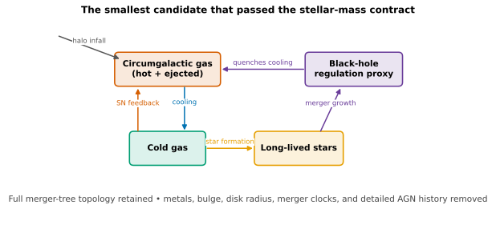
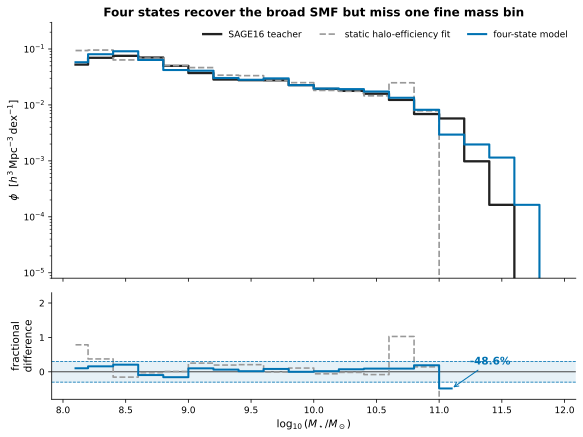
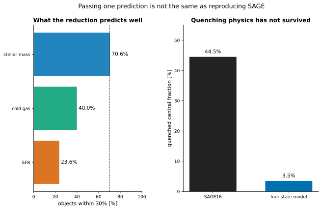
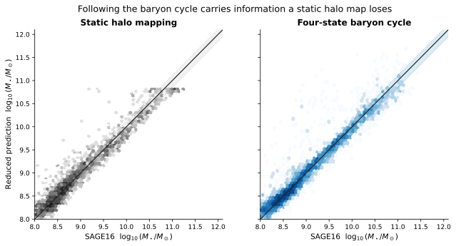

# How much of SAGE can we remove?

A held-out test of how much SAGE16 z=0 stellar-mass information survives in a much smaller reservoir model.

[Machine-readable manifest](report.json)

## Run overview

| Item | Value |
| --- | --- |
| Model | SAGE16 teacher / four-state reduced baryon cycle |
| Dataset / trees | Mini-Millennium partitions 1--3 development; partition 4 model selection; partition 5 untouched replication |
| Parameter set | nine coefficients fitted to SAGE16 z=0 stellar mass |
| Integration method | two conservative analytic transfer substeps per tree interval |
| Reduced state fields | 4 |
| Fitted coefficients | 9 |
| Resolved galaxies within 30% | 70.5622 % |
| Worst populated 0.4-dex SMF error | 13.4048 % |

Related: [Mini-Millennium science report](../mini-millennium-sage16-science-program/index.md) · [Faithful SAGE16 implementation](../mini-millennium-sage16-initial/index.md) · [Machine-readable arrays](assets/mini-millennium-sage16-minimal.npz)

## Run health

| Check | Status | Evidence |
| --- | --- | --- |
| Predeclared stellar-mass contract | ✅ Passed | 70.6% of resolved galaxies are within 30%, only 0.6 percentage points above the gate; the worst populated 0.4-dex SMF bin differs by 13.4%. |
| Fine-bin stellar mass function | ⚠️ Warning | The worst populated 0.2-dex bin differs by 48.6%, outside 30%. |
| Cold gas, SFR, and quenching | ❌ Failed | Only 40.0% of cold-gas masses and 23.6% of SFRs are within 30%; the quenched fraction is 3.5% versus 44.5% in SAGE. |
| Reduced baryon conservation | ✅ Passed | Every local cooling/star-formation/feedback update is an explicit transfer; the maximum held-out residual is 1.137e-13 in SAGE mass units. |

## At a glance



*The retained reservoirs, forcing, transfers, and explicitly discarded SAGE16 detail.*



*SAGE16, a static halo mapping, and the four-state model on untouched partition 5.*



*Within-30% rates and the failed quenched-fraction prediction.*

## How much of SAGE can four variables reproduce?

The minimal model preserves much of the integrated z=0 stellar-mass prediction, but not the present-day baryon cycle or quenching state.

The answer is **yes for a deliberately narrow prediction, and no for SAGE as a whole**.

- The four-state model passes the locked z=0 stellar-mass test on the untouched replication partition, but narrowly: **70.6%** of resolved galaxies are within 30%, only **0.6 percentage points** above the gate. The worst populated 0.4-dex mass-function bin is **13.4%** from SAGE.

- A static halo-to-stellar-mass mapping reaches only **52.2%** within 30%; explicit gas history and merger topology carry useful information.

- Fine 0.2-dex structure is not fully reproduced: the worst populated bin misses by **48.6%**.

- The same model does **not** reproduce gas or ongoing activity: its quenched-central fraction is **3.5%**, versus **44.5%** for SAGE.

- Partition 4 was used for candidate selection: the four-state model reached **72.21%** within 30%, versus **72.18%** for a five-state model with explicit ejected gas; both had a **14.75%** worst coarse-bin error. The five-state fit also drove its reincorporation time to **0.01 Gyr**, the lower bound, so that state was removed before partition 5 was opened.


*The retained reservoirs, forcing, transfers, and explicitly discarded SAGE16 detail.*

## What did we require before fitting?

The 30% statement was made testable before the final replication catalogue was opened.

Development used Mini-Millennium partitions 1--3. Partition 4 compared locked four- and five-state candidates and selected the simpler model because the extra ejected reservoir did not improve the target. The rejected candidate sent a mass-dependent fraction of feedback to a separate ejected reservoir and returned it exponentially on one fitted reincorporation timescale. The four-state form, coefficients, fitting data, mass resolution, binning, and thresholds were then frozen before partition 5 was opened.

The primary gate requires at least 70% of resolved individual z=0 stellar masses to lie within 30% of SAGE16, plus every 0.4-dex stellar-mass-function bin containing at least 20 SAGE galaxies to lie within 30%. The familiar 0.2-dex SMF is retained as a stricter diagnostic. Cold gas, SFR, and quenching were declared secondary tests rather than optimized acceptance quantities.

This is therefore a claim about **z=0 stellar mass**, not a claim that the reduced model is interchangeable with SAGE16 for arbitrary observables or histories.

### Predeclared stellar-mass contract

**Status:** ✅ Passed

70.6% of resolved galaxies are within 30%, only 0.6 percentage points above the gate; the worst populated 0.4-dex SMF bin differs by 13.4%.

**Acceptance criterion:** at least 70% of individual masses within 30%, and every 0.4-dex bin with at least 20 SAGE galaxies within 30%

### Fine-bin stellar mass function

**Status:** ⚠️ Warning

The worst populated 0.2-dex bin differs by 48.6%, outside 30%.

**Acceptance criterion:** diagnostic only; not part of the locked acceptance gate

## What information does the merger-tree baryon cycle add?

Following four evolving states is substantially more faithful than mapping peak halo mass directly to stellar mass on the replication partition.

The static comparison has four fitted coefficients but no memory. The dynamical model retains the same raw halo merger trees and carries gas supply, star formation, feedback, and a minimal regulation memory forward through time.



*A static mapping compared with the history-dependent four-state baryon cycle.*

## Does the minimal model preserve the stellar mass function?

Yes at the predeclared 0.4-dex resolution; the 0.2-dex diagnostic still exposes a 48.6% local discrepancy.

The upper panel is the conventional z=0 stellar mass function. The lower panel makes the 30% requirement visible. Only bins with at least 20 SAGE galaxies enter the residual test, so a single sparsely occupied high-mass bin cannot masquerade as a robust percentage statement.


*SAGE16, a static halo mapping, and the four-state model on untouched partition 5.*

## Which SAGE predictions did not survive the reduction?

Cold gas, current SFR, and the quenched population fail decisively; integrated stellar mass alone is an insufficient model-selection target.

The four-state fit only minimized robust log stellar-mass residuals. Its poor secondary predictions are therefore an honest out-of-objective test, not a surprise hidden by retuning.

The failure suggests that a future broader reduction must retain more of the regulation history or change its fitting target. It does **not** justify adding states until an untouched test shows that they improve a predeclared observable set.


*Within-30% rates and the failed quenched-fraction prediction.*

### Cold gas, SFR, and quenching

**Status:** ❌ Failed

Only 40.0% of cold-gas masses and 23.6% of SFRs are within 30%; the quenched fraction is 3.5% versus 44.5% in SAGE.

- These were declared secondary diagnostics before fitting, not silently promoted after seeing the result.

## What is the actual reduced model?

A conservative forced reservoir model with three mass reservoirs, one regulation-memory variable, nine fitted coefficients, and explicit merger events.

The state is $x=(M_{\rm CGM},M_{\rm cold},M_\star,M_{\rm BH,proxy})$. Halo mass, spin, redshift, infall budgets, and the raw merger topology are external forcing/events.

Cooling transfers CGM gas to cold gas. Above a spin-dependent threshold, cold gas is processed into long-lived stars and feedback return. The mass-loading factor is a halo-mass power law. Cooling is reduced by a halo-mass term and by the accumulated black-hole proxy. All finite transfers are capped analytically through exponential depletion factors, so local reservoirs remain non-negative and baryon conservation is structural.

This is a teacher--student reduction calibrated to SAGE16. It is not a replacement physical model, and its coefficients should not be interpreted as newly measured SAGE parameters.

Related: [Reduced-model source](https://github.com/yipihey/mimic-jax/blob/main/mimic_jax/sage16/reduced.py)

## What is the next scientifically defensible test?

Broaden the acceptance contract before adding complexity, then demand that every extra state improve an untouched partition.

- Define population-level cold-gas, SFR, and quenched-fraction tolerances, not only individual ratios near zero.
- Fit the same four-state structure to that multi-observable objective and reserve a new Mini-Millennium partition for the final test.
- Only then retest explicit ejected-gas/reincorporation or stored AGN-heating memory; keep a state only if it improves held-out observables.
- Test redshift evolution after z=0 targets pass. A z=0 emulator can hide the wrong history.

## Why trust this conclusion?

The positive and negative claims are tied to explicit checks, and failed diagnostics remain visible.

[Minimal-model analysis summary](assets/mini-millennium-sage16-minimal.json) — Acceptance contract, fitted coefficients, scalar tests, and limitations.

[Partition-4 model-selection summary](assets/mini-millennium-sage16-minimal-validation-p4.json) — The held-out candidate-selection result preceding the untouched partition-5 replication.

[Rejected explicit-ejected-reservoir candidate](assets/mini-millennium-sage16-minimal-rejected-ejected-p4.json) — State, coefficients, boundary-saturating reincorporation time, and partition-4 metrics for the rejected five-state trial.

[Minimal-model scientific arrays](assets/mini-millennium-sage16-minimal.npz) — Replication-partition galaxy predictions and stellar-mass-function arrays.

### Predeclared stellar-mass contract

**Status:** ✅ Passed

70.6% of resolved galaxies are within 30%, only 0.6 percentage points above the gate; the worst populated 0.4-dex SMF bin differs by 13.4%.

**Acceptance criterion:** at least 70% of individual masses within 30%, and every 0.4-dex bin with at least 20 SAGE galaxies within 30%

### Fine-bin stellar mass function

**Status:** ⚠️ Warning

The worst populated 0.2-dex bin differs by 48.6%, outside 30%.

**Acceptance criterion:** diagnostic only; not part of the locked acceptance gate

### Cold gas, SFR, and quenching

**Status:** ❌ Failed

Only 40.0% of cold-gas masses and 23.6% of SFRs are within 30%; the quenched fraction is 3.5% versus 44.5% in SAGE.

- These were declared secondary diagnostics before fitting, not silently promoted after seeing the result.

### Reduced baryon conservation

**Status:** ✅ Passed

Every local cooling/star-formation/feedback update is an explicit transfer; the maximum held-out residual is 1.137e-13 in SAGE mass units.

## Parameters

| Parameter | Value | Units | Description |
| --- | ---: | --- | --- |
| `BlackHoleQuenchingMass` | 0.00046114 | 1e10 Msun/h proxy | Regulation-memory scale; not a faithful SAGE black-hole mass. |
| `ColdGasThresholdPerSpin` | 0.220808 | 1e10 Msun/h | Cold-gas threshold per unit halo-spin magnitude. |
| `CoolingRedshiftExponent` | 1.62107 | dimensionless | Power-law redshift dependence of effective cooling. |
| `CoolingTimescaleGyr` | 1.15981 | Gyr | Effective circumgalactic cooling timescale. |
| `FeedbackHaloMassSlope` | 1.92023 | dimensionless | Halo-mass slope of the effective feedback loading. |
| `FeedbackMassLoadingAtPivot` | 0.166819 | dimensionless | Cold-to-circumgalactic mass loading at the fixed halo-mass pivot. |
| `QuenchingHaloMass` | 10 | 1e10 Msun/h | Effective halo-mass scale that suppresses cooling. |
| `QuenchingSlope` | 0.823383 | dimensionless | Sharpness of halo-mass cooling suppression. |
| `StarFormationTimescaleGyr` | 0.359048 | Gyr | Effective cold-gas processing timescale. |

## Provenance and reproducibility

| Item | Value |
| --- | --- |
| Generated | 2026-08-19T14:07:44Z |
| Git commit | `35654446bb0c175d1ceefe1501a372efed19d5f4` (dirty working tree) |
| Git branch | main |

### Rerun command

```shell
/Users/tabel/Projects/mimic-jax/.venv/bin/python examples/build_sage16_minimal_model_report.py --input-json /Users/tabel/Projects/mimic-jax/archive/mini-millennium-sage16-minimal.json --input-arrays /Users/tabel/Projects/mimic-jax/archive/mini-millennium-sage16-minimal.npz --validation-json /Users/tabel/Projects/mimic-jax/archive/mini-millennium-sage16-reduction-p4.json --rejected-candidate-json /Users/tabel/Projects/mimic-jax/archive/mini-millennium-sage16-reduction-delayed.json
```

### Configurations and inputs

| Role | Path | SHA-256 | Bytes |
| --- | --- | --- | ---: |
| input | `archive/mini-millennium-sage16-minimal.json` | `8990b619d487f8d823f35c381d699a0625e9d37b02d688859ca186b1d05570c6` | 7355 |
| input | `archive/mini-millennium-sage16-minimal.npz` | `b2571f87b37442b93fc447572bd1f288821e71eb519f44a5b2cafdaa8c1ef0e5` | 201950 |
| input | `archive/mini-millennium-sage16-reduction-p4.json` | `bef0a417b7d74a14698aa6534ebcd00a4ddda0274dca81868eaf3858295cf534` | 6680 |
| input | `archive/mini-millennium-sage16-reduction-delayed.json` | `06c9ec0b434246de0a9009e6d16665e1ef9c0f0253f33b110c2d78f41ecd7289` | 1497 |

### Software

| Name | Value |
| --- | --- |
| h5py | 3.16.0 |
| jax | 0.4.38 |
| jaxlib | 0.4.38 |
| matplotlib | 3.11.1 |
| mimic-jax | 0.1.0 |
| numpy | 2.5.2 |
| python | 3.13.0 |

### Hardware and backend

| Name | Value |
| --- | --- |
| jax_backend | cpu |
| jax_devices | ['TFRT_CPU_0'] |
| machine | arm64 |
| processor | arm |
| release | 25.6.0 |
| system | Darwin |
