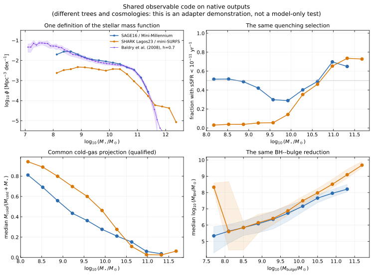
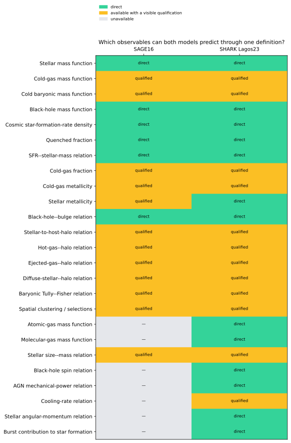
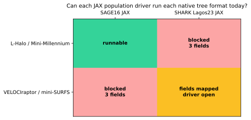

# Can SAGE16 and SHARK be compared without hidden conventions?

A science-facing interoperability audit: both native catalogues now feed the same observable definitions, while merger-tree portability is measured honestly rather than inferred from similar field names.

[Machine-readable manifest](report.json)

## Compared runs

| Role | Run | Run ID |
| --- | --- | --- |
| Baseline | [SAGE16 / Mini-Millennium](../mini-millennium-sage16-science-program/index.md) | `mini-millennium-sage16-science-program` |
| Candidate | [SHARK Lagos23 / mini-SURFS](../shark-continuous-foundation/index.md) | `shark-continuous-foundation` |

## Comparison health

| Check | Status | Evidence |
| --- | --- | --- |
| Canonical catalogue projection | ✅ Passed | 36,530 SAGE16 and 7,553 SHARK rows were projected into explicit physical units with field provenance. |
| Cross-tree population execution | ⚠️ Warning | 0 of 2 foreign-tree model paths are runnable today. Both formats now project into one audited forcing contract, but required halo conventions and population drivers remain open. |
| Independent SHARK JAX topology driver | ⚠️ Warning | The native SHARK population physics shadow replay is fully evaluated, but native SHARK still owns variable-cardinality topology and event scheduling. |
| Shared observation comparison | ⚠️ Warning | The Baldry et al. (2008) stellar mass function has a durable shared loader; other legacy SAGE observation compilations are not yet model-neutral datasets. |

## Observable differences

| Observable | Baseline | Candidate | Difference | Fractional difference | Derivative prediction |
| --- | ---: | ---: | ---: | ---: | ---: |
| z=0 catalogue rows | 36530 | 7553 | -28977 | -79.3238% | not defined |
| SFR density above 1e8 Msun | 0.0135373 Msun yr^-1 Mpc^-3 | 0.0157507 Msun yr^-1 Mpc^-3 | 0.00221337 Msun yr^-1 Mpc^-3 | 16.3501% | not defined |

- **z=0 catalogue rows:** The counts are not a model-only comparison because the simulations, volumes, resolution, cosmology, and tree construction differ.
- **SFR density above 1e8 Msun:** This verifies one common reduction and selection; it must not be interpreted as an isolated SAGE--SHARK physics difference until same-forcing runs exist.

## What the audit establishes

The useful overlap is already substantial, but common forcing is not yet solved.

- **18 of 25** reviewed observable definitions are available for both catalogues; 12 carry a visible physical qualification.
- **6** are direct under the current definition.
- **0 of 2** foreign-tree execution paths are runnable: common data structures are no substitute for missing halo semantics or topology drivers.
- **1 observational product** is currently registered in the shared layer; expanding this is now a data/provenance task rather than a model-specific plotting task.

## Can both catalogues answer the same questions?

Yes for the principal mass, SFR, gas, metallicity, BH, and halo relations. The figure uses exactly the same reductions on both native catalogues.

The curves are deliberately **not** presented as a controlled model comparison: Mini-Millennium and mini-SURFS differ in tree finder, cosmology, volume, and resolution. Their purpose here is to prove that the observable boundary no longer changes code between models.



*Identical selections, bins, physical units, and zero handling; native forcing differs.*

[Shared observable arrays](assets/native-common-observables.npz) — Compact numerical arrays behind the figure.

## What overlaps—and what remains model-specific?

Unavailable quantities remain unavailable; mimic-jax does not invent an HI/H2 split for SAGE or relabel different disk-radius definitions as identical.

| Observable | SAGE16 | SHARK Lagos23 | Shared interpretation |
| --- | --- | --- | --- |
| Stellar mass function | direct | direct | One canonical definition and unit convention. |
| Cold-gas mass function | qualified | qualified | Cold-phase definitions are similar but not mathematically identical across SAMs. |
| Cold baryonic mass function | qualified | qualified | This declared cold-baryon definition excludes hot, ejected, and diffuse reservoirs. |
| Black-hole mass function | direct | direct | One canonical definition and unit convention. |
| Cosmic star-formation-rate density | direct | direct | One canonical definition and unit convention. |
| Quenched fraction | direct | direct | One canonical definition and unit convention. |
| SFR--stellar-mass relation | direct | direct | One canonical definition and unit convention. |
| Cold-gas fraction | qualified | qualified | Cold-phase definitions are similar but not mathematically identical across SAMs. |
| Cold-gas metallicity | qualified | qualified | This is not an oxygen-line calibration; comparison to 12+log(O/H) needs a convention. |
| Stellar metallicity | qualified | direct | One canonical definition and unit convention. |
| Black-hole--bulge relation | direct | direct | One canonical definition and unit convention. |
| Stellar-to-host-halo relation | qualified | qualified | Host-mass definitions and central selection must be aligned. |
| Hot-gas--halo relation | qualified | qualified | Reservoir ownership across satellites and FoF groups must be aligned. |
| Ejected-gas--halo relation | qualified | qualified | The location and ownership of the ejected reservoir differ between models. |
| Diffuse-stellar--halo relation | qualified | qualified | SAGE ICS and SHARK stellar-halo boundaries arise from different stripping prescriptions. |
| Baryonic Tully--Fisher relation | qualified | qualified | Vmax ownership for satellites/orphans and the observational velocity proxy must be declared. |
| Spatial clustering / selections | qualified | qualified | Requires the same simulation volume, cosmology, periodic boundary, and selection. |
| Atomic-gas mass function | unavailable | direct | One canonical definition and unit convention. |
| Molecular-gas mass function | unavailable | direct | One canonical definition and unit convention. |
| Stellar size--mass relation | qualified | qualified | SAGE and SHARK radius definitions differ and must remain visible. |
| Black-hole spin relation | unavailable | direct | One canonical definition and unit convention. |
| AGN mechanical-power relation | unavailable | direct | One canonical definition and unit convention. |
| Cooling-rate relation | unavailable | qualified | SAGE's public Cooling output is an energy proxy, not this mass rate. |
| Stellar angular-momentum relation | unavailable | direct | One canonical definition and unit convention. |
| Burst contribution to star formation | unavailable | direct | One canonical definition and unit convention. |



*Direct, qualified, and unavailable outputs under one reviewed contract.*

## Can either model run the other model's trees?

Not yet. Both native formats now project into a canonical tree-local forcing record, but cross-running still lacks scientifically validated conventions and drivers.

| Source tree | Target model | Field contract | JAX population driver | Missing fields |
| --- | --- | --- | --- | --- |
| lhalo_binary | SAGE16 | ready | ready | none |
| lhalo_binary | SHARK Lagos23 | incomplete | open | `main_progenitor_row`, `concentration`, `is_interpolated` |
| shark_velociraptor_hdf5 | SAGE16 | incomplete | open | `first_progenitor_row`, `virial_radius`, `velocity_dispersion` |
| shark_velociraptor_hdf5 | SHARK Lagos23 | ready | open | none |



*Field completeness and topology-driver readiness are evaluated separately.*

- For SAGE on SHARK trees, the L-Halo first-progenitor ordering, velocity dispersion, virial radius, and Spin-vector convention remain unresolved.
- For SHARK on L-Halo trees, concentration, interpolation/DHalo flags, main-progenitor semantics, and halo-spin/size conventions remain unresolved.
- SHARK's exhaustive JAX RHS replay validates physics evaluations; it does not yet replace native SHARK's population topology/event scheduler.

## Can observations be compared once rather than model by model?

The Baldry et al. stellar mass function is the first shared observational product. Other legacy arrays must be extracted with citations, IMF, aperture, h, and calibration conventions before becoming common data.

The plotted Baldry curve uses one declared target convention (`h=0.7`, Chabrier IMF) for both models. A model-specific cosmology must not silently move the observation between panels.

| Observable | Current status | Source / next gate |
| --- | --- | --- |
| stellar mass function | registered | Baldry, Glazebrook & Driver (2008); ready for both canonical catalogues |
| cosmic sfr density | legacy_embedded | multi-survey compilation in legacy SAGE plotting code; extract individual citations, units, selection, and covariance |
| gas mass functions | legacy_embedded | Zwaan et al. (2005); Obreschkow & Rawlings (2009); extract tables and keep HI/H2 versus total-cold definitions separate |
| gas mass metallicity | legacy_analytic_relation | Tremonti et al. relation in legacy SAGE plotting code; record calibration, IMF transform, aperture, and total-Z conversion |
| black hole bulge | legacy_analytic_relation | Haring & Rix (2004) relation in legacy SAGE plotting code; record scatter, IMF/bulge definition, sample selection, and covariance |
| stellar mass density evolution | legacy_embedded | Marchesini et al. (2009) compilation in legacy SAGE plotting code; extract redshift bins, IMF/h convention, uncertainties, and covariance |
| baryonic tully fisher | not_audited | legacy SAGE plotting module; define observed and model velocity proxies before extracting data |
| quenched fraction | unregistered | no durable shared observational product; choose aperture, sSFR threshold, redshift, and sample selection |

## Reusable products for the next model

The complete field provenance, observable capabilities, tree blockers, and claim boundaries are machine-readable. A third model can implement the same adapters instead of adding another pairwise comparison path.

[Model comparison audit](assets/model-comparison-audit.json) — Canonical fields, observable support, tree readiness, and explicit claims.

Related: [SHARK implementation guide](../../docs/shark_lagos23.md) · [SAGE--SHARK integration plan](../../docs/dev/MIMIC-JAX-SHARK-INTEGRATION-PLAN.md)

## Provenance and reproducibility

| Item | Value |
| --- | --- |
| Generated | 2026-08-20T15:33:47Z |
| Git commit | `d74457736333d348ceae8996966d53cd67070f5e` (dirty working tree) |
| Git branch | main |

### Rerun command

```shell
scripts/audit_sage_shark_interoperability.py --sage-catalogues output/sage16-mini-millennium/model_000.hdf5 output/sage16-mini-millennium/model_001.hdf5 output/sage16-mini-millennium/model_002.hdf5 output/sage16-mini-millennium/model_003.hdf5 output/sage16-mini-millennium/model_004.hdf5 output/sage16-mini-millennium/model_005.hdf5 output/sage16-mini-millennium/model_006.hdf5 output/sage16-mini-millennium/model_007.hdf5 --lhalo-tree simulations/mini-millennium/snapshots/trees_063.0 --scale-factors simulations/mini-millennium/mini-millennium.a_list --shark-catalogue /tmp/mimic-shark-release-reference/mini-SURFS/lagos23-reference/199/0/galaxies.hdf5 --shark-tree /tmp/mimic-shark-input/tree_199.0.hdf5 --output reports/sage16-shark-interoperability-audit
```

### Configurations and inputs

| Role | Path | SHA-256 | Bytes |
| --- | --- | --- | ---: |
| configuration | `docs/dev/MIMIC-JAX-SHARK-INTEGRATION-PLAN.md` | `bd3dd2e555558613f9a0fe61a1b91d3a3d73f4116f81911c0201fd65caf3c614` | 30293 |
| input | `output/sage16-mini-millennium/model_000.hdf5` | `5a379968075170672ba7a45b191f4527cde70a3ef4a5dac98e3bf3a4e8821e95` | 7176983 |
| input | `output/sage16-mini-millennium/model_001.hdf5` | `059d2243b37409da2e2399cd700b43509a98ba5efa3932e2d3972c839c17eda7` | 6366807 |
| input | `output/sage16-mini-millennium/model_002.hdf5` | `08c22c6ce8014da859fd3d8cee78a9337a942681b541da565893dae5c9b18060` | 9322359 |
| input | `output/sage16-mini-millennium/model_003.hdf5` | `2e1731d6a175cb8efbffdb01031a4fe2d733addccfccc6e1e83e194c414f72f7` | 11976855 |
| input | `output/sage16-mini-millennium/model_004.hdf5` | `cbd810a2b926fc89a0d9cf32a7a72a2bb9842cd9ded98810b8f08e65972fbb67` | 6651415 |
| input | `output/sage16-mini-millennium/model_005.hdf5` | `d2c1fbaee8e6d381ef5b0527ba34dd9ba4cc54e24548bb2fa806dea826ae84c9` | 7189815 |
| input | `output/sage16-mini-millennium/model_006.hdf5` | `5d1cc3180a87c1ad445bf28a16732dcd7002a2642f1175b64c09e411a9677041` | 5846967 |
| input | `output/sage16-mini-millennium/model_007.hdf5` | `18e810dc839da64e84bbb2439b22255f64819ba472f7af315d93b00c8a8443f7` | 5856791 |
| input | `/private/tmp/mimic-shark-release-reference/mini-SURFS/lagos23-reference/199/0/galaxies.hdf5` | `78cc1148f0ff39dfe05d10b81124724104fd1d56150b7fd47dffc7a3be837aca` | 3161736 |
| input | `simulations/mini-millennium/snapshots/trees_063.0` | `f24229a92639f701bed129110673f0fc88820435e1dd1e56f2d7af912d92aca1` | 18197616 |
| input | `/private/tmp/mimic-shark-input/tree_199.0.hdf5` | `c072a937941fefb9aac441fc319ff030ceb666af4a07f1b88c0f02c5d76a3f43` | 26479838 |
| input | `simulations/mini-millennium/mini-millennium.a_list` | `2866412ae276939c625afef8a92a1da442fcc4bd8490dda191f38a0f5028164f` | 577 |
| input | `data/observations/baldry2008_stellar_mass_function.csv` | `8775324d2e2eb732a77eaf9ac6102d3ca1422a23bbc81e3f2c2ad4ea894d253b` | 1612 |

### Software

| Name | Value |
| --- | --- |
| h5py | 3.16.0 |
| jax | 0.4.38 |
| jaxlib | 0.4.38 |
| matplotlib | 3.11.1 |
| mimic-jax | 0.1.0 |
| numpy | 2.5.2 |
| python | 3.13.0 |

### Hardware and backend

| Name | Value |
| --- | --- |
| jax_backend | cpu |
| jax_devices | ['TFRT_CPU_0'] |
| machine | arm64 |
| processor | arm |
| release | 25.6.0 |
| system | Darwin |

### Random seeds

| Name | Value |
| --- | --- |
| SHARK native reference | 123456 |
