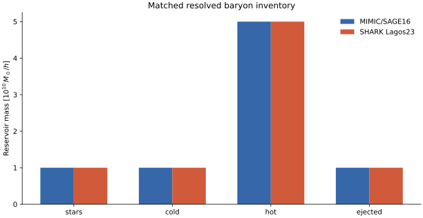
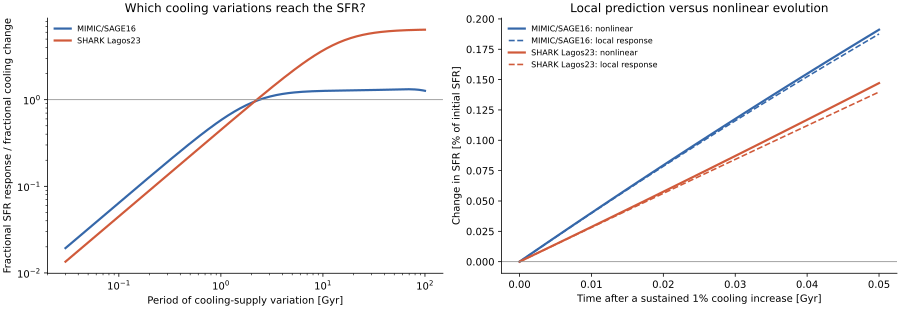
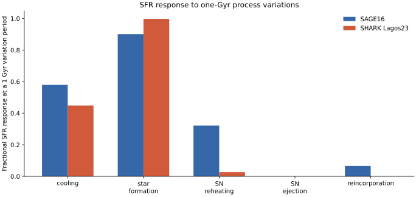
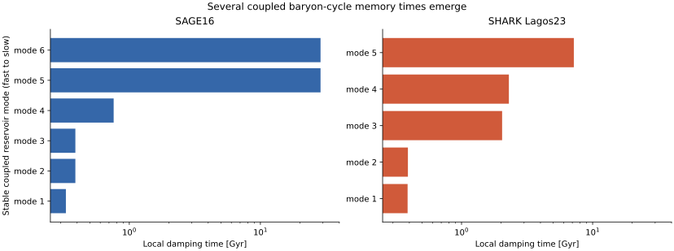

# Do SAGE16 and SHARK regulate the same matched disk in the same way?

A deliberately controlled first response experiment. SAGE16 and SHARK start with the same principal baryon inventory, disk scale, velocity, cooling supply, and metal fractions. Their familiar instantaneous SFRs are close here, but their coupled responses need not be. This is the foundation for—not a substitute for—the same-tree population comparison.

[Machine-readable manifest](report.json)

## Compared runs

| Role | Run | Run ID |
| --- | --- | --- |
| Baseline | MIMIC/SAGE16 continuous central subset | `sage16-common-local-response` |
| Candidate | SHARK Lagos23 controlled disk subset | `shark-common-local-response` |

## Comparison health

| Check | Status | Evidence |
| --- | --- | --- |
| Common executable protocol | ✅ Passed | Both configured models expose state, forcing, parameters, named process controls, RHS/rates, conservation, Jacobians, and annotated local response through one API. |
| Local conservation | ✅ Passed | Baryon and source-corrected metal rate residuals close at the matched operating point. |
| Local response versus nonlinear evolution | ✅ Passed | The frozen local response was tested against 0.1%, 1%, and 5% sustained cooling perturbations over 0.05 Gyr. |
| Population-level model isolation | ⬚ Not evaluated | The experiment matches one local baryon inventory and forcing boundary; it does not yet run both full models on the same merger-tree population. |
| Matched AGN regulation | ⬚ Not evaluated | SAGE radio-mode history and SHARK hot-halo AGN/heating memory are outside the two matched continuous subsets used here. No cross-model AGN conclusion is made. |

## Observable differences

| Observable | Baseline | Candidate | Difference | Fractional difference | Derivative prediction |
| --- | ---: | ---: | ---: | ---: | ---: |
| Instantaneous SFR at the matched state | 2.79746e+09 Msun/h/Gyr | 2.83613e+09 Msun/h/Gyr | 3.86697e+07 Msun/h/Gyr | 1.38232% | not defined |
| Cooling-to-SFR response at a 10 Gyr period | 1.26193 fraction/fraction | 3.67564 fraction/fraction | 2.41371 fraction/fraction | 191.271% | not defined |
| Slowest finite stable local mode | 28.758 Gyr | 7.18804 Gyr | -21.57 Gyr | -75.0051% | not defined |

- **Instantaneous SFR at the matched state:** The near agreement is a useful operating point, not a calibration or population-equivalence result.
- **Cooling-to-SFR response at a 10 Gyr period:** This asks how strongly a slow fractional cooling variation appears in fractional SFR near the same local state.
- **Slowest finite stable local mode:** This is the longest damping time among locally stable modes; neutral tracker modes are excluded.

## What exactly is being compared?

One controlled local experiment removes several avoidable convention differences before asking a dynamical question.

Both calculations use $M_\star=M_\mathrm{cold}=M_\mathrm{eject}=10^{10}\,M_\odot/h$, $M_\mathrm{hot}=5\times10^{10}\,M_\odot/h$, a 5 kpc/$h$ disk scale, $V=220$ km/s, and $z=0$. The SHARK half-mass radius is the matching exponential-disk conversion. The SAGE cooling and reincorporation rates are converted from the MIMIC code time unit to Gyr and used as SHARK's prepared external supply. This aligns the local question while retaining each model's own star-formation and feedback prescriptions.



*The same four principal mass reservoirs initialize both local calculations; model-specific trackers and angular momentum remain separate.*

## Does SFR remember the same cooling perturbation in the same way?

No global linearity is assumed. JAX differentiates each nonlinear RHS at the matched state, and the resulting local prediction is checked by evolving the nonlinear model.

The left panel treats cooling variability with period $T=2\pi/\omega$ and shows $|H(i\omega)|$ for fractional SFR per fractional cooling change. The right panel gives the direct physical experiment: keep cooling 1% higher and watch the SFR over the next 0.05 Gyr. Agreement with the nonlinear trajectories is the validity test; the comparison does not rely on the matrix calculation alone. The process-gain panel must be read with the declared closure: SHARK cooling is prepared external forcing in this controlled subset, so reincorporated hot gas has no return path to SFR here. Its zero reincorporation gain is therefore a boundary limitation, not yet a statement about full SHARK. SAGE SN ejection is also zero at this operating point because that branch is inactive.



*Frequency response uses variation period 2π/ω. Dashed curves are frozen-coefficient predictions; solid curves evolve each nonlinear RHS.*



*Absolute fractional SFR response to a fractional process perturbation varying with a one-Gyr period; signs and phases remain in the array product.*

[Local response arrays](assets/local-response-arrays.npz) — Complex signed transfer arrays, modes, and nonlinear validation histories.

## How many memory times does each baryon cycle contain?

The coupled reservoirs generate several stable damping times rather than one recipe timescale.

These are eigenmode e-folding times of the local state Jacobian after converting both native time conventions to Gyr. Exact neutral tracker/integrated-mass modes are excluded. Mode composition is not labelled yet because mixed mass, metal, and angular-momentum coordinates require a separately declared nondimensional participation convention.



*Finite stable eigenmode damping times after converting both models to Gyr and applying an input-output-invariant state scaling.*

## What does this first comparison not establish?

The experiment is deliberately narrower than the full scientific claim.

It does not show that full SAGE and SHARK populations differ for model-physics reasons; that requires the same merger-tree forcing, aligned selections, and both hybrid event schedulers. It also does not compare the closed AGN loops: SAGE's radio-mode heating history and SHARK's hot-halo BH/heating-radius state must be matched without reducing either to an externally prescribed loading. Those remain explicit not-evaluated gates rather than blank panels or inferred conclusions.

## How does this fit the differentiable-galaxy ecosystem?

The discovery of Sapphire narrows the engineering target: reuse generic differentiable tooling and focus mimic-jax on faithful established-model representation and comparison.

| Package/model | What it already does well | mimic-jax decision |
|---|---|---|
| Sapphire | Purpose-built JAX regulator, Diffrax integration, optimization, Fisher/HMC and accelerator execution | Interoperate and reuse generic ecosystem tools; compare scientific response where states and forcing can be matched |
| Diffmah | Differentiable halo mass-assembly histories | Optional controlled forcing adapter; retain real merger trees as reference |
| Diffstar / DiffstarPop | Differentiable SFH and population distributions | Complementary emulator/comparison layer, not a SAM port |
| DSPS | Differentiable SFH/metallicity-to-SED/photometry mapping | Optional output adapter with SPS/filter provenance |
| Galacticus | Mature adaptive ODE plus tree-event architecture | Numerical/architectural reference and independent analytic tests; no copied implementation |
| SAGE16 / SHARK | Established production SAM physics and familiar observables | Preserve upstream equivalence, expose common flows/events/conservation/responses |

[Machine-readable model protocols](assets/model-protocols.json) — State, forcing, parameter, process, capability, formulation, and upstream-revision metadata for both configured models.

## What is the next decisive experiment?

Run the two complete hybrid models on common halo histories, then compare regulation rather than only outputs.

The next science report should pair common population observables with baryon flows, parameter elasticities, historical process responses, cooling-to-SFR transfer, and AGN regulation. A result will be called a model-physics difference only after tree semantics, cosmology, forcing interpolation, numerical error, and selection differences are controlled.

[Machine-readable local response summary](assets/local-response-summary.json) — Operating point, formulation qualifications, response times, and validation errors.

Related: [SAGE–SHARK interoperability audit](../sage16-shark-interoperability-audit/index.md) · [SAGE response report](../sage16-linear-response/index.md) · [Common protocol plan](../../docs/dev/MIMIC-JAX-COMMON-SAM-PROTOCOL-PLAN.md) · [Sapphire](https://github.com/virajpandya/sapphire)

## Provenance and reproducibility

| Item | Value |
| --- | --- |
| Generated | 2026-08-21T07:34:10Z |
| Git commit | `36f781e7f1165de753f1f106bff876abe9fd3727` (dirty working tree) |
| Git branch | main |

### Rerun command

```shell
scripts/generate_common_sam_response_report.py --output reports/sage16-shark-response-foundation --validation-duration-gyr 0.05 --validation-steps 100
```

### Configurations and inputs

| Role | Path | SHA-256 | Bytes |
| --- | --- | --- | ---: |
| configuration | `docs/dev/MIMIC-JAX-COMMON-SAM-PROTOCOL-PLAN.md` | `cda5460894b9441afbf9f4f85552644ae5ae7ada0ed86a7ea2b0bcc229f63e4e` | 13672 |

### Software

| Name | Value |
| --- | --- |
| h5py | 3.16.0 |
| jax | 0.4.38 |
| jaxlib | 0.4.38 |
| matplotlib | 3.11.1 |
| mimic-jax | 0.1.0 |
| numpy | 2.5.2 |
| python | 3.13.0 |

### Hardware and backend

| Name | Value |
| --- | --- |
| jax_backend | cpu |
| jax_devices | ['TFRT_CPU_0'] |
| machine | arm64 |
| processor | arm |
| release | 25.6.0 |
| system | Darwin |
