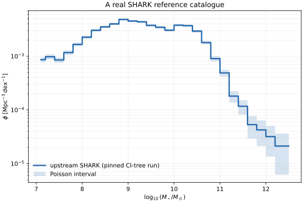
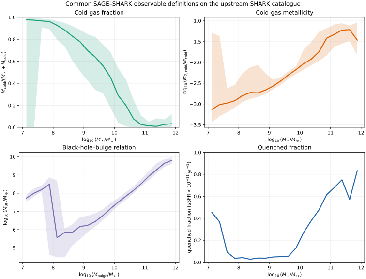
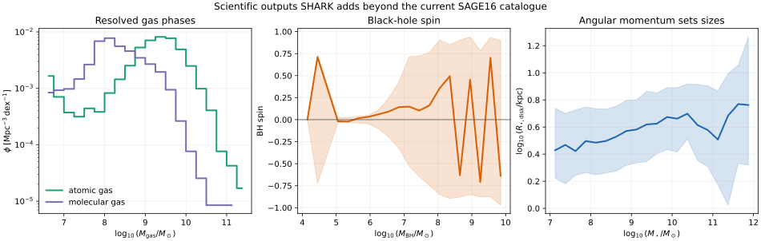
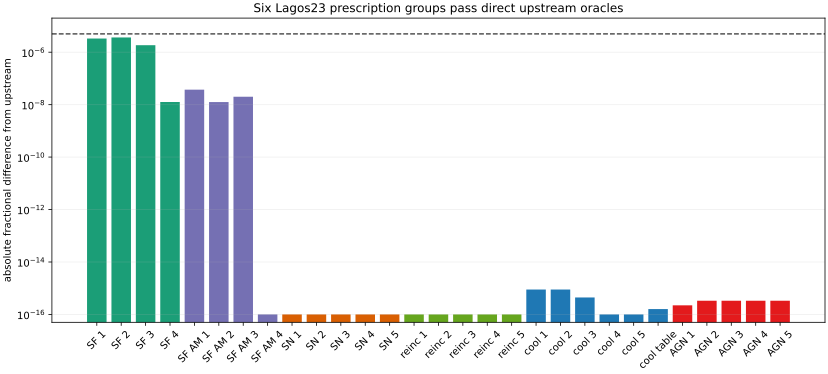
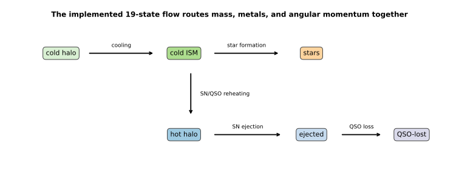
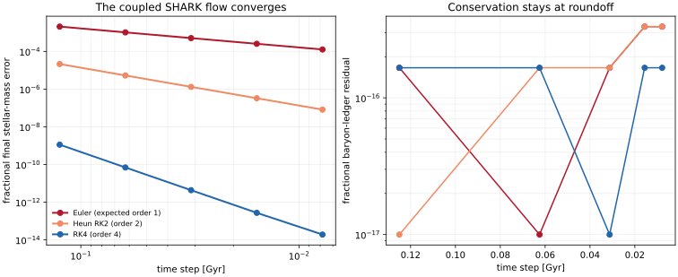
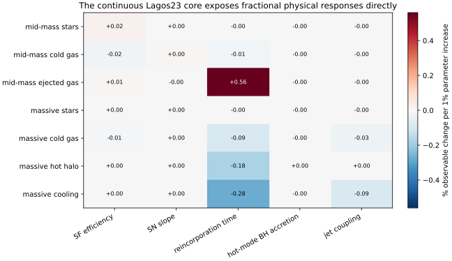

# SHARK Lagos23 on the same testable footing as SAGE16

A complete native Lagos23 population remains the topology/event reference, while the independent JAX implementation now covers the disk and burst ODEs, BH/AGN memory and spin, mergers, instabilities, environmental transfers, and shared observables.

[Machine-readable manifest](report.json)

## Run overview

| Item | Value |
| --- | --- |
| Model | SHARK Lagos23 native reference plus mimic-jax continuous/hybrid implementation |
| Dataset / trees | upstream public CI mini-SURFS tree, batch 0 |
| Parameter set | sample_lagos23.cfg |
| Integration method | exact native hybrid reference; explicit JAX reference order and continuous RK4 |
| Reference galaxies | 7553 |
| Output redshift | 0 |
| Continuous flow variables | 19 |
| Reservoir + BH/AGN state variables | 24 |
| Native galaxy fields available | 86 |
| Full-tree JAX RHS evaluations | 5709080 |
| Maximum full-tree rate relative difference | 0.000122948 |
| Maximum controlled interval residual | 2.50749e-05 |
| Maximum controlled burst residual | 9.82719e-05 |
| Report analysis wall time | 31.5446 s |

Related: [SAGE16 science program](../mini-millennium-sage16-science-program/index.md) · [SAGE16 response times](../sage16-linear-response/index.md)

## Run health

| Check | Status | Evidence |
| --- | --- | --- |
| Pinned upstream SHARK oracle | ✅ Passed | The clean pinned upstream executable completed the public CI tree and the catalogue records the expected revision, version, seed, and 7,553 galaxies. |
| 19-state flow equations | ✅ Passed | The JAX flow assembly reproduces every equation in upstream basic_physicalmodel_evaluator for controlled named rates. |
| Full-tree JAX population physics replay | ⚠️ Warning | The compiled JAX kernel evaluated every one of the 5,709,080 disk and starburst RHS calls realized by all 20,174 trees. Three of 62,799,880 named-rate values exceed the predeclared 1.1e-4 strict gate; none exceeds the explicit 1.5e-4 quadrature warning band, and all 19-state routing comparisons pass the strict gate. The traced and clean native catalogues are bitwise identical across all 5,332,172 compared values. |
| BR06 radial star-formation prescription | ✅ Passed | Four disk/burst cases agree with the pinned upstream prescription to better than 5 parts per million, including angular-momentum transport. |
| Lagos13 stellar-feedback loadings | ✅ Passed | Five velocity/redshift cases reproduce the upstream reheating, ejection, and angular-momentum loadings exactly in float64 output. |
| Lagos23 reincorporation finite map | ✅ Passed | Five central/satellite and halo-mass cases reproduce upstream's finite transfer and source cap exactly. |
| Sobacchi13 reionisation gate | ✅ Passed | All eight velocity/redshift cases select the same cooling-suppression branch as the pinned upstream model. |
| Croton06 cooling preparation | ✅ Passed | Five halo cases reproduce upstream cooling radii, unheated rates, and integrated cooling luminosities at float64 precision. |
| Deterministic Lagos23 AGN rates | ✅ Passed | Five black-hole cases reproduce hot-mode accretion, mechanical and bolometric luminosity, radiative efficiency, QSO wind loadings, and the upstream luminosity gate. |
| Ordered disk interval against upstream SHARK | ✅ Passed | The finite reincorporation/infall/seed/BH/cooling preparation, 19-state disk solve, heating-memory projection, and post-solve state agree with a real upstream BasicPhysicalModel interval. |
| Merger/instability starburst sequence | ✅ Passed | Finite BH fuel removal, Griffin19 spin, boosted bulge star formation, SN/QSO feedback, and post-burst BH growth agree with the upstream sequence. |
| Mass, metal-source, and angular-momentum ledgers | ✅ Passed | Mass and angular momentum cancel structurally; the metal ledger closes after subtracting the explicitly named stellar-yield source. Derivative ledgers also close. |
| Continuous hot-mode black-hole transfer | ✅ Passed | Hot-mode growth transfers hot gas and metals into the augmented BH state. The removed gas angular momentum is an explicit sink because SHARK stores dimensionless BH spin rather than BH angular momentum in the baryon ledger. |
| Controlled flow convergence | ✅ Passed | The nonlinear Croton06-cooling, BR06-star-formation, and Lagos13-feedback flow recovers first-, second-, and fourth-order convergence for Euler, Heun, and RK4. |
| Differentiable fractional parameter responses | ✅ Passed | JAX directly returns dimensionless reservoir and cooling responses for SN-regulated and massive AGN-heated controlled galaxies. |
| Independent JAX full-tree population parity | ⚠️ Warning | This gate is now evaluated rather than unknown: exhaustive JAX shadow replay covers the continuous population physics with three explicit BR06 quadrature warnings, but the native driver still supplies variable-cardinality topology and branch states. A topology-owning JAX catalogue match is therefore not yet claimed. |

## At a glance



*The pinned upstream executable on its public CI tree. This establishes the reference population; it is not yet a mimic-jax parity overlay.*



*Cold-gas fraction, cold-gas metallicity, BH–bulge relation, and quenched fraction evaluated through explicit model-neutral binning and selection rules.*



*Native atomic/molecular gas mass functions, BH spin, and disk-size outputs retained rather than collapsed into the SAGE16 state. Relation bins require at least 20 galaxies so rare objects are not presented as a stable trend.*



*Radial star-formation/angular-momentum, stellar-feedback, reincorporation, Sobacchi13 reionisation, Croton06 cooling, and deterministic Lagos23 AGN cases generated by the pinned upstream SHARK library.*



*Mass, metals, and angular momentum use one named transfer assembly.*



*Euler, Heun RK2, and RK4 recover their expected orders for a controlled nonlinear Croton06+BR06+Lagos13 SHARK disk flow while its baryon ledger stays at roundoff.*



*Each entry is the percentage change in a final reservoir or integrated cooling transfer per 1% parameter increase, evaluated by JAX AD.*

[Full-tree JAX population replay evidence](assets/shark-full-tree-jax-parity.json) — Counts, tolerances, checksums, and streaming errors from all 5,709,080 realized native disk/starburst RHS states.

## What is the SHARK reference prediction?

We begin with a genuine upstream Lagos23 run, not a toy reinterpretation. The stellar mass function supplies the first familiar population target that mimic-jax must reproduce.

Mass is the sum `mstars_disk + mstars_bulge`; volume and $h$ come from the native catalogue produced through mimic-jax's managed, checksum-recorded upstream backend. An independent per-ID JAX replay is deliberately not overplotted: that stricter population-equivalence gate remains open.


*The pinned upstream executable on its public CI tree. This establishes the reference population; it is not yet a mimic-jax parity overlay.*

## Do the first JAX physics prescriptions reproduce SHARK?

Yes for the isolated prescription suite and complete controlled intervals: BR06 molecular star formation, Lagos13 feedback, reincorporation, Sobacchi13 reionisation, Croton06 cooling, deterministic Lagos23 AGN rates, Griffin19 spin, the ordered disk interval, and the event-triggered starburst now pass direct upstream oracles.

The fixture is generated by a small C++ harness linked to the clean pinned SHARK library. It does not reimplement the expected equations in Python. The residual BR06 difference comes from replacing upstream's 5%-tolerance adaptive GSL radial integral with deterministic 128-node JAX quadrature; it is below $5\times10^{-6}$ in all four controlled cases. Interval and burst comparisons exercise the actual upstream BasicPhysicalModel ordering rather than equations copied into the test.


*Radial star-formation/angular-momentum, stellar-feedback, reincorporation, Sobacchi13 reionisation, Croton06 cooling, and deterministic Lagos23 AGN cases generated by the pinned upstream SHARK library.*

## Can SHARK be compared through the same familiar observables?

The catalogue adapter now evaluates four additional SAGE-facing summaries with shared binning, finite-value, unit, and zero-handling rules.

These curves are the real pinned upstream SHARK population, not yet a JAX population overlay. Their purpose is to make the target comparison contract executable: one definition will consume either a SAGE or SHARK catalogue. The gas-metallicity panel intentionally shows the native metal mass fraction; an oxygen-abundance calibration will be added only with an explicit convention.


*Cold-gas fraction, cold-gas metallicity, BH–bulge relation, and quenched fraction evaluated through explicit model-neutral binning and selection rules.*

[Machine-readable foundation arrays](assets/shark-foundation-results.npz) — Catalogue summaries, controlled convergence histories, direct-oracle residuals, and fractional-response matrices used by this report.

## What part of SHARK is already a dynamical system?

Upstream SHARK already integrates a 19-variable disk/starburst system. mimic-jax makes its physical rates and conservative routing explicit.

The state contains six masses, six corresponding metal masses, two episode trackers, and five total angular momenta. Cooling, star formation, recycling, stellar reheating/ejection, and QSO loss enter as named rates. Continuous mode augments this with BH mass/metals/spin, heating radius, and excess jet power. The heating radius uses the exact running-maximum projection. Finite infall and caps, seeded and burst BH growth, Griffin19 spin, mergers, disk instabilities, stripping, and merger clocks are explicit hybrid maps; they are not mislabeled as smooth ODE terms.


*Mass, metals, and angular momentum use one named transfer assembly.*

## Does the continuous transfer network converge in time?

Yes for the implemented state-dependent flow foundation: refining the step reduces stellar-mass error at the designed method order without opening the baryon ledger.

This test evolves the actual oracled Croton06 cooling, BR06 radial star-formation, and Lagos13 stellar-feedback prescriptions through the continuous conservative routing. Halo structure is held fixed while the tabulated rate responds to the evolving hot mass and metallicity. This analysis treats hybrid events as explicit maps rather than assigning them a fictitious ODE order. Event-time convergence across an entire merger tree remains part of the open independent population-replay gate.


*Euler, Heun RK2, and RK4 recover their expected orders for a controlled nonlinear Croton06+BR06+Lagos13 SHARK disk flow while its baryon ledger stays at roundoff.*

[Machine-readable foundation arrays](assets/shark-foundation-results.npz) — Catalogue summaries, controlled convergence histories, direct-oracle residuals, and fractional-response matrices used by this report.

## What does SHARK add to the SAGE comparison?

The managed reference catalogue and shared observable layer now retain SHARK's phase-resolved gas, structure, angular momentum, and BH-spin outputs rather than collapsing them onto the smaller SAGE16 catalogue contract.

| Added SHARK capability | Resulting comparison/science output |
| --- | --- |
| Atomic/molecular partition and five SF laws | HI/H2 mass functions, depletion times, phase-resolved responses |
| Component angular momentum and sizes | disk/bulge size–mass and AM relations |
| BH spin plus radiative/mechanical AGN power | spin, luminosity, jet-power, and quenching diagnostics |
| Gradual hot/ISM ram-pressure and tidal stripping | environmental gas loss and stellar-halo assembly |
| Burst channels by merger versus instability | causal decomposition of bulge growth and starbursts |
| Cold-halo, ejected, QSO-lost, and stripped reservoirs | a more resolved baryon-cycle ledger |


*Native atomic/molecular gas mass functions, BH spin, and disk-size outputs retained rather than collapsed into the SAGE16 state. Relation bins require at least 20 galaxies so rare objects are not presented as a stable trend.*

## Which Lagos23 parameters control a galaxy interval?

The continuous/hybrid implementation produces practitioner-facing fractional responses directly: percent change in a familiar output per one-percent change in a physical parameter.

Rows are final stellar, cold-gas, hot-gas, BH, SFR, cooling, and ejected-gas outputs for controlled SN-regulated and massive AGN-heated systems. Columns are physically labelled Lagos23 parameters. A response of -0.6 means that a 1% parameter increase lowers that output by approximately 0.6% locally. The first active response column is checked against symmetric finite differences; inactive threshold branches remain exactly zero rather than being smoothed.


*Each entry is the percentage change in a final reservoir or integrated cooling transfer per 1% parameter increase, evaluated by JAX AD.*

[Machine-readable foundation arrays](assets/shark-foundation-results.npz) — Catalogue summaries, controlled convergence histories, direct-oracle residuals, and fractional-response matrices used by this report.

## Does the JAX physics survive the full population?

Every disk and starburst derivative actually requested by the complete public-CI population was independently recalculated by one compiled JAX kernel, with a narrow BR06 quadrature warning retained explicitly.

The run covers 5,709,080 realized RHS states from 15,116 galaxies across snapshots 60–198: 3,474,024 disk evaluations and 2,235,056 starburst evaluations. BR06 star formation supplies the largest rate difference, 1.2295e-4 relative, because mimic-jax uses deterministic 128-node quadrature where upstream uses adaptive GSL quadrature. Three of 62,799,880 named-rate values (4.8e-8 of the comparison population), all BR06 star-formation rates, exceed the predeclared 1.1e-4 strict gate. None exceeds the separately recorded 1.5e-4 warning band. All 108,472,520 routed derivative values pass the strict gate. The opt-in trace itself is non-perturbing: all 5,332,172 values in 1,462 galaxy datasets across 17 native output snapshots are bitwise identical to the clean reference run. A final derivative can be ill-conditioned when large physical transfers nearly cancel, so the report gates the rate layer and the stoichiometric routing separately rather than hiding cancellation behind a misleading relative error.

This is stronger than a handful of controlled fixtures, but it is a shadow replay: upstream still supplies the realized merger/type-2 topology. The yellow health row keeps that remaining distinction visible.

[Full-tree JAX population replay evidence](assets/shark-full-tree-jax-parity.json) — Counts, tolerances, checksums, and streaming errors from all 5,709,080 realized native disk/starburst RHS states.

## What remains before a topology-owning JAX catalogue?

Full-population continuous physics is now measured, with its narrow quadrature warning quantified. The remaining work is narrower and explicit: reproduce SHARK's variable-cardinality galaxy ownership and event schedule without borrowing realized states from upstream.

The public tree contains 31 positive descendant IDs that upstream deliberately skips under `skip_missing_descendants=true`; mimic-jax now parses and reports those cases rather than rejecting the file. The next strict gate must own stable galaxy IDs, type-2 transfer, and per-ID event history, then compare the resulting catalogue. A SAGE–SHARK physics comparison then requires common halo forcing; comparing native Mini-Millennium with native mini-SURFS would otherwise mix model and simulation differences.

## Parameters

| Parameter | Value | Units | Description |
| --- | ---: | --- | --- |
| `recycle` | 0.4588 |  | Lagos23 sample instantaneous recycling fraction |
| `yield` | 0.02908 |  | Lagos23 sample stellar yield |
| `ode_solver_precision` | 0.05 |  | upstream relative ODE tolerance |

## Provenance and reproducibility

| Item | Value |
| --- | --- |
| Generated | 2026-08-20T14:11:49Z |
| Git commit | `d74457736333d348ceae8996966d53cd67070f5e` (dirty working tree) |
| Git branch | main |

### Rerun command

```shell
python scripts/generate_shark_foundation_report.py --upstream-output /tmp/mimic-shark-release-reference/mini-SURFS/lagos23-reference/199/0/galaxies.hdf5 --upstream-config /tmp/mimic-shark-release-reference/effective-shark.cfg --report-directory reports/shark-continuous-foundation --population-parity reports/shark-continuous-foundation/assets/shark-full-tree-jax-parity.json
```

### Configurations and inputs

| Role | Path | SHA-256 | Bytes |
| --- | --- | --- | ---: |
| configuration | `/private/tmp/mimic-shark-release-reference/effective-shark.cfg` | `f94d665d0cc5d24c9e48b3f9050e481ee28e13d5a05b40d6fbb4c1eb493fafeb` | 4131 |
| input | `/private/tmp/mimic-shark-release-reference/mini-SURFS/lagos23-reference/199/0/galaxies.hdf5` | `78cc1148f0ff39dfe05d10b81124724104fd1d56150b7fd47dffc7a3be837aca` | 3161736 |
| input | `tests/mimic_jax/fixtures/shark/lagos23_rate_oracle.json` | `7bd9e3e5304209a6056200a67da1317b3f88a5a1f2962e61fe16995e1538f1f3` | 20917 |
| input | `reports/shark-continuous-foundation/assets/shark-full-tree-jax-parity.json` | `c0630765d51fe39871ca001ad4f08b816f4647ae75145a6aa5a78a1b9b189441` | 3958 |

### Software

| Name | Value |
| --- | --- |
| h5py | 3.16.0 |
| jax | 0.4.38 |
| jaxlib | 0.4.38 |
| matplotlib | 3.11.1 |
| mimic-jax | 0.1.0 |
| numpy | 2.5.2 |
| python | 3.13.0 |

### Hardware and backend

| Name | Value |
| --- | --- |
| jax_backend | cpu |
| jax_devices | ['TFRT_CPU_0'] |
| machine | arm64 |
| processor | arm |
| release | 25.6.0 |
| system | Darwin |

### Random seeds

| Name | Value |
| --- | --- |
| upstream_shark | 123456 |

### Upstream reference run record

```json
{
  "galaxies": 7553,
  "project": "ICRAR/shark",
  "redshift": 0.0,
  "redshift_input_sha256": "816a885a6e73d6d9022fffeb8667acfe2b0719a6cb0da2d696abe61500b135b9",
  "revision": "5af50d8fa7a040883409b10171c645e1db4e5fb2",
  "tree_input_sha256": "c072a937941fefb9aac441fc319ff030ceb666af4a07f1b88c0f02c5d76a3f43",
  "version": "2.0.0"
}
```
