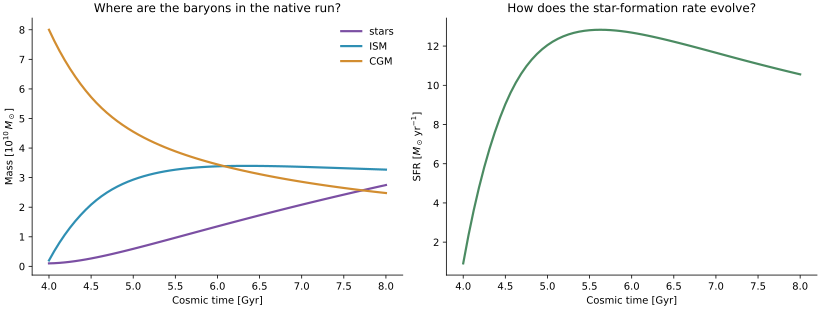
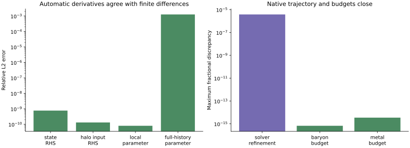
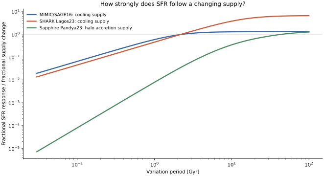
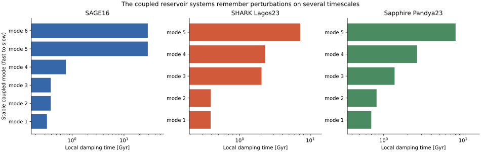

# What becomes comparable when SAGE16, SHARK, and Sapphire share one analysis language?

Sapphire is now a native third configured model rather than an architectural footnote. Its Pandya23 equations remain owned and executed by Sapphire in an isolated modern-JAX environment; mimic-jax imports versioned scientific artifacts and asks the same questions about reservoirs, forcing, conservation, parameter derivatives, and local response.

[Machine-readable manifest](report.json)

## Compared models

| Model | Run ID |
| --- | --- |
| MIMIC/SAGE16 | `sage16-common-local-response` |
| SHARK Lagos23 | `shark-common-local-response` |
| Sapphire Pandya23 | `sapphire-v0.130-native-controlled` |

## Comparison health

| Check | Status | Evidence |
| --- | --- | --- |
| Three configured model boundaries | ✅ Passed | SAGE16, SHARK Lagos23, and native Sapphire Pandya23 load through one registry with state, forcing, parameter, process, observable, and capability metadata. |
| Native Sapphire local derivative validation | ✅ Passed | State, fractional halo-input, and fixed-state parameter-to-observable Jacobians are checked against symmetric finite differences. |
| End-to-end Sapphire parameter derivatives | ✅ Passed | Final-observable derivatives pass through the native adaptive Diffrax trajectory and are compared with symmetric finite differences across five perturbation sizes. The looser gate records the accept/reject controller's discrete path rather than pretending it is a smooth local RHS. |
| Native Sapphire integration refinement | ✅ Passed | The requested 1e-8 adaptive solve is compared with a 1e-10 solve for the same physical case. |
| Three-model local conservation | ✅ Passed | Each evaluated continuous calculation closes its declared mass, metal, and where present angular-momentum ledger after external boundaries are included. |
| Identical process-control surface | ⚠️ Warning | SAGE16 and SHARK expose explicit cooling/feedback process perturbations. The unmodified Sapphire closure currently exposes halo-input and parameter perturbations; mimic-jax does not copy or rewrite its RHS to fabricate process hooks. |
| Same-history population comparison | ⬚ Not evaluated | Sapphire's native smooth central-halo histories are not yet matched to the full branch/event topology used by SAGE16 and SHARK. |

## Common quantities

| Quantity | MIMIC/SAGE16 | SHARK Lagos23 | Sapphire Pandya23 |
| --- | ---: | ---: | ---: |
| Continuous state coordinates | 8 | 19 | 7 |
| Exposed parameter coordinates | 15 | 55 | 16 |
| Named fractional process controls | 5 | 7 | 0 |
| Slowest finite stable local mode | 28.758 Gyr | 7.18804 Gyr | 8.04521 Gyr |
| Supply-to-SFR response at a 10 Gyr period | 1.26193 fraction/fraction | 3.67564 fraction/fraction | 0.337457 fraction/fraction |
| Event/topology capability | model_specific | model_specific | unavailable |
| Maximum normalized local conservation residual | 8.52651e-14 fraction of max(source, sink, 1 native rate unit) | 8.72766e-16 fraction of max(source, sink, 1 native rate unit) | 3.48129e-15 fraction of max(source, sink, 1 native rate unit) |

- **Continuous state coordinates:** Different dimensions reflect different model physics; they are not padded into a universal state.
- **Exposed parameter coordinates:** Parameter counts describe the audited formulation, not comparable degrees of freedom.
- **Named fractional process controls:** Sapphire exposes native halo-input and parameter derivatives but no copied process-control hooks.
- **Slowest finite stable local mode:** Each value belongs to its declared local operating point and closure boundary.
- **Supply-to-SFR response at a 10 Gyr period:** SAGE16/SHARK inputs are cooling; Sapphire's input is upstream halo accretion, so the latter includes CGM filtering.
- **Event/topology capability:** Unavailable is a model-scope statement, not a failed numerical test.
- **Maximum normalized local conservation residual:** Each ledger includes its declared external source and sink boundary before normalization.

## What can be compared today?

The three models now share an analysis language, while every scientific comparison retains an explicit evidence state.

| Question | Status | What the comparison means |
|---|---|---|
| Can all three expose named state, forcing, parameters, processes, and observables? | **Evaluated** | One semantic registry and machine-readable protocol, without padding states into a universal vector. |
| Can all three expose a local continuous RHS and state Jacobian? | **Evaluated** | SAGE16/SHARK run in-process; Sapphire is evaluated by its pinned native Pandya23 runtime. |
| Can all three close baryon and metal budgets? | **Evaluated** | SAGE16/SHARK use structural ledgers; Sapphire includes halo inflow, CGM outflow, yield, and enriched-flow boundaries. |
| Can all three be asked how SFR responds to changing supply? | **Qualified** | SAGE16/SHARK perturb cooling; Sapphire perturbs dark-matter accretion before CGM filtering. |
| Can all three expose parameter responses? | **Evaluated with distinct coordinates** | The normalization and metadata API is shared; parameter identities and derivative horizons are not silently equated. |
| Can all three be compared on the same full merger-tree population? | **Not evaluated** | A smooth-main-branch forcing adapter, population weights, and aligned selections remain required. |
| Can merger and satellite event maps be compared across all three? | **Not applicable** | The audited Sapphire independent-central model has no such topology. |

[Three-model comparison matrix](assets/three-model-comparison-matrix.json) — Evaluated, qualified, unavailable, and not-evaluated comparison domains with reservoir and observable semantics.

## Is this actually Sapphire?

Yes: the controlled trajectory and derivatives come from the pinned upstream Pandya23 closure and native Diffrax solver.

The bridge runs Sapphire v0.130 at revision `ee50e858e3427de50368c32205001248849b8be0` with its official SD93 cooling table. It converts Sapphire's internal $d\log_{10}x/d\log_{10}t$ derivative back to physical $dx/dt$ before exporting the state Jacobian. The complete case, solver tolerances, cooling-table checksum, software versions, device, trajectory, rates, and finite-difference arrays accompany this page.



*Pandya23 is run by Sapphire v0.130 with native Diffrax Tsit5 integration under constant smooth halo forcing.*



*AD/finite-difference, tolerance-refinement, and open-system conservation diagnostics are computed from the pinned native run.*

[Native Sapphire artifact manifest](assets/sapphire-artifact.json) — Pinned revision, case, coordinates, solver, finite-difference validation, cooling-table checksum, software, and hardware.

[Native Sapphire trajectory and response arrays](assets/sapphire-arrays.npz) — Physical trajectory, rates, state/input/parameter Jacobians, finite differences, and convergence arrays.

## What is genuinely common across the three models?

The commonality is semantic and mathematical, not an invented claim that the reservoirs or prescriptions are identical.

| Concept | SAGE16 | SHARK Lagos23 | Sapphire Pandya23 |
|---|---|---|---|
| Continuous state | Cold/hot/ejected/stars + metals | Disk/halo/ejected/lost + metals, trackers, angular momentum | Stars/ISM/CGM + CGM thermal energy + metals |
| Halo forcing | Merger-tree virial properties | Native SHARK tree/halo interval data | Smooth $\dot M_h$, $M_h$, $R_\mathrm{vir}$, $V_\mathrm{vir}$, concentration |
| Events | Mergers, instability, stripping/topology maps | Mergers, instability, disruption and native topology | Not present in the audited independent-central model |
| Differentiable inputs here | Named process controls and parameters | Named process controls and nested parameters | Fractional halo inputs and native Pandya23 parameters |
| Common observables available now | Stellar/gas masses and SFR | Stellar/gas masses and SFR | Stellar/ISM/CGM masses, SFR and metallicities |

[Three-model semantic manifests](assets/three-model-protocols.json) — State, forcing, parameters, processes, capabilities, qualifications, and upstream revisions.

## Which reservoirs really correspond?

Several physical roles overlap, but the report preserves phase boundaries and model-specific memory rather than equating names.

| Physical role | SAGE16 | SHARK Lagos23 | Sapphire Pandya23 | Comparison status |
|---|---|---|---|---|
| Long-lived stars | `StellarMass` | `stellar_mass` | `M_star` | Direct local mass quantity |
| Star-forming gas | `ColdGas` | `cold_gas` | `M_ism` | Qualified by phase and aperture conventions |
| Halo atmosphere | `HotGas` | `cold_halo_gas` + `hot_halo_gas` | `M_cgm` plus `Eth_cgm` | Qualified; not synonymous state coordinates |
| Ejected material | `EjectedGas` | `ejected_gas` + `lost_gas` | No separate reservoir | Unavailable as a three-model reservoir comparison |
| Metals | Cold/hot/ejected/stellar | Six gas/stellar reservoirs plus trackers | Stellar/ISM/CGM | Total metal budgets compare; individual reservoirs remain qualified |
| Dynamical memory | Upstream history/event state outside this local vector | Angular momentum, formed-mass trackers, AGN memory in wider model | CGM thermal energy | Model-specific; mode composition must use named coordinates |

## Which baryon-cycle processes overlap?

All three contain supply, cooling, star formation, feedback transport, and enrichment, but their closure boundaries differ.

| Physical process | SAGE16 | SHARK Lagos23 | Sapphire Pandya23 | Safe comparison today |
|---|---|---|---|---|
| Cosmological supply | Finite tree-driven infall budget | Native halo-interval infall preparation | Smooth halo accretion forcing | Forcing metadata and open-system budget |
| Cooling | Hot-to-cold transfer | Halo-to-disk cooling supply | CGM energy loss plus CGM-to-ISM transfer | Local response, with input boundary stated |
| Star formation | Thresholded disk law with recycling | Pressure-based molecular disk law with recycling | ISM depletion law with recycling | SFR and local derivatives, not recipe identity |
| Stellar feedback | Reheating and ejection | Reheating, ejection, QSO channels | ISM wind plus energy injection and CGM outflow | Flux/budget roles; process controls are not yet identical |
| Reincorporation | Explicit ejected-to-hot flow | Explicit ejected return | No separate ejected reservoir | Two-model process comparison only |
| Metal enrichment | Yield plus advective flows | Yield plus multi-reservoir transport | Yield plus stellar/ISM/CGM transport | Total metal conservation and qualified metallicities |
| AGN/BH regulation | Present in full hybrid SAGE16 | Present in full SHARK | Absent in audited Pandya23 model | Not a three-model comparison |

## On what timescales does star formation follow its supply?

The same response machinery can be applied without pretending the input boundary is the same.

For SAGE16 and SHARK the experiment perturbs the cooling transfer directly. For Sapphire it perturbs dark-matter accretion, which changes baryonic halo inflow and must propagate through the CGM before reaching the ISM. The different boundary is scientifically useful: it separates a recipe-level cooling response from the full atmosphere's filtering of halo supply.



*SAGE16 and SHARK are perturbed at the cooling boundary; Sapphire is perturbed at the upstream dark-matter accretion boundary. The distinction is part of the result, not hidden normalization.*

## Do the three baryon cycles forget perturbations on the same timescales?

Each nonlinear model generates several coupled local damping times rather than inheriting one recipe timescale.

The poles are calculated from each physical state Jacobian after an input-output-invariant state scaling. Neutral integrated-mass/tracker modes are excluded. The current figure compares local mathematical structure, not matched galaxies: a same-history mass/redshift grid is the next evidence gate.



*Stable local damping times at each explicitly recorded operating point; direct numerical values should not be interpreted as a same-halo population comparison.*

## Do the three local baryon cycles close their budgets?

Yes for the evaluated local calculations, once every model's external boundary is included explicitly.

The maximum normalized residuals are `8.527e-14` for SAGE16, `8.728e-16` for SHARK, and `3.481e-15` for Sapphire. For closed ledgers the denominator floor is one native rate unit; for open ledgers it is the larger declared source or sink. This is a numerical closure test, not a claim that the models place baryons in equivalent reservoirs.

## Which familiar outputs can eventually be compared?

Stellar mass, SFR, star-forming gas, and metallicity provide the strongest three-model overlap; abundance statistics require one more population-level gate.

| Observable | Three-model status | Required qualification |
|---|---|---|
| Stellar mass | Direct local overlap | Align IMF, units, aperture, selection, and population weights for catalogues |
| Star-formation rate | Direct local overlap | Align instantaneous/averaged definitions before observational comparison |
| Cold gas / ISM mass | Qualified overlap | Preserve phase definitions; Sapphire's ISM is not automatically a SAGE/SHARK cold-gas aperture |
| Stellar metallicity | Available | Align mass weighting, yield convention, and solar normalization |
| Gas metallicity | Qualified overlap | Align gas phase and distinguish metal mass fraction from observational oxygen calibration |
| Stellar mass function | Not evaluated for three models | Sapphire needs a number-density-complete or explicitly weighted population on compatible halo histories |
| Black-hole and AGN observables | Unavailable across all three | Pandya23 has no BH/AGN state; retain the established SAGE16--SHARK comparison separately |
| Satellite/environment/clustering statistics | Not applicable to current Sapphire model | Requires an extended topology-owning model rather than an invented adapter |

## What does a common parameter response mean?

The API is common; the parameters and time horizons remain physical properties of each model.

Mimic-jax exposes dimensionless fractional responses when the observable and parameter have meaningful positive scales, $E_{O,\theta}=\partial\ln O/\partial\ln\theta$, and explicit reference-scale responses otherwise. SAGE16 and SHARK can differentiate their in-process configured subsets. Sapphire now exports both a fixed-state local parameter Jacobian and the derivative of final observables through its complete adaptive native trajectory. Sapphire's `A_*` coordinates are base-10 logarithmic normalizations and several slope parameters are zero or signed, so the report does not label raw coordinate derivatives as elasticities or match them one-to-one with SAGE/SHARK parameters.

## What remains before a population-level three-model science claim?

The adapter is executable and validated, but the forcing and topology domains are not yet identical.

Sapphire currently models independent central histories and familiar scaling relations, whereas full SAGE16 and SHARK include branch topology, satellites, mergers, black holes, and additional observables. The next comparison must construct a documented main-progenitor forcing adapter, preserve each model's event scope, attach population weights, and then compare SMHM, gas fractions, metallicity, SFMS, and any number-density statistic that is actually defined for the sample.

Related: [SAGE16–SHARK response foundation](../sage16-shark-response-foundation/index.md) · [Sapphire source](https://github.com/virajpandya/sapphire) · [Common protocol plan](../../docs/dev/MIMIC-JAX-COMMON-SAM-PROTOCOL-PLAN.md)

## Provenance and reproducibility

| Item | Value |
| --- | --- |
| Generated | 2026-08-21T09:49:19Z |
| Git commit | `36f781e7f1165de753f1f106bff876abe9fd3727` (dirty working tree) |
| Git branch | main |

### Rerun command

```shell
scripts/generate_three_model_response_report.py --output reports/three-model-response-foundation --sapphire-artifact tests/data/sapphire/native-v0.130-controlled
```

### Configurations and inputs

| Role | Path | SHA-256 | Bytes |
| --- | --- | --- | ---: |
| configuration | `docs/dev/MIMIC-JAX-SAPPHIRE-INTEGRATION-PLAN.md` | `1c10d4073d38b19932bd0decaa0cbf97111ab9fa40f1f19eefdf326f2a4ee01d` | 7849 |
| input | `tests/data/sapphire/native-v0.130-controlled/artifact.json` | `e46deee5c1eb1808b0bb8ef620a636b6970b3b8dd83d3653506bbfdf73275a53` | 17673 |
| input | `tests/data/sapphire/native-v0.130-controlled/arrays.npz` | `2134ab03cc27981bd2798891fae0542fddb1e73ff6614966e1b934e2bb2c5ed1` | 19754 |

### Software

| Name | Value |
| --- | --- |
| h5py | 3.16.0 |
| jax | 0.4.38 |
| jaxlib | 0.4.38 |
| matplotlib | 3.11.1 |
| mimic-jax | 0.1.0 |
| numpy | 2.5.2 |
| python | 3.13.0 |

### Hardware and backend

| Name | Value |
| --- | --- |
| jax_backend | cpu |
| jax_devices | ['TFRT_CPU_0'] |
| machine | arm64 |
| processor | arm |
| release | 25.6.0 |
| system | Darwin |
